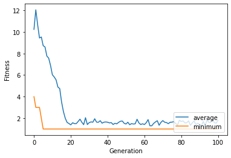
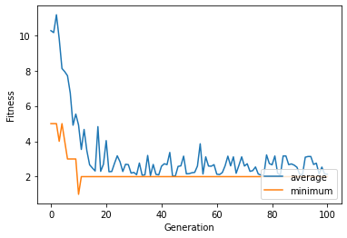
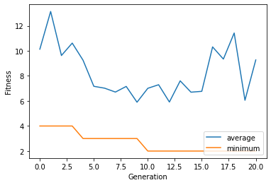
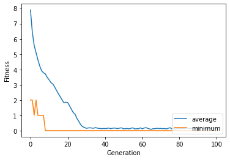
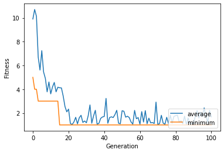
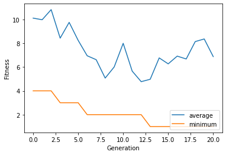

## Project 4:  Solving N-Queens Problem using Genetic Algorithms

#### CSC 180  Intelligent Systems

#### Dr. Haiquan Chen, California State University, Sacramento


## Part I: Position-index-based board representation


```python
# Insert your name, your id, course title, assignment id, and due date here as comment 
# CSC180 Intelligent Systems
# Mini-Project 4
# Daniel E. Villavicencio Mena (302262597), Niravkumar Tandel (220218142), Mariya Cherednichenko (302037411)


```


```python
import random
import numpy as np
!pip install deap
from deap import algorithms, base, creator, tools

creator.create("FitnessMin", base.Fitness, weights=(-1.0,))
creator.create("Individual", list, fitness=creator.FitnessMin)

```

    Requirement already satisfied: deap in /usr/local/lib/python3.7/dist-packages (1.3.1)
    Requirement already satisfied: numpy in /usr/local/lib/python3.7/dist-packages (from deap) (1.21.6)


    /usr/local/lib/python3.7/dist-packages/deap/creator.py:141: RuntimeWarning: A class named 'FitnessMin' has already been created and it will be overwritten. Consider deleting previous creation of that class or rename it.
      RuntimeWarning)
    /usr/local/lib/python3.7/dist-packages/deap/creator.py:141: RuntimeWarning: A class named 'Individual' has already been created and it will be overwritten. Consider deleting previous creation of that class or rename it.
      RuntimeWarning)


```python
def create_individual():
  n = random.sample(range(64), 8)
  n.sort()
  return n 
```


```python
print(create_individual())
```

    [4, 6, 7, 11, 28, 39, 50, 52]


```python
def show_grid(board):
    
    n = [0]*64
    for i in board:
        n[i] = 1
    
    
    for i in range(8):
        for j in range(64):
            if j // 8 == i:
                if n[j] == 1:
                    print('X',end="|")
                else:
                    print('-',end="|")
        print()
        print("----------------")

```


```python
toolbox = base.Toolbox()

toolbox.register("individual", tools.initIterate, creator.Individual, create_individual)

toolbox.register("population", tools.initRepeat, list, toolbox.individual)
```


```python
pop = toolbox.population(n=5)

print(pop[0])
```

    [25, 28, 30, 42, 44, 45, 54, 63]


```python
show_grid(pop[0])
```

    -|-|-|-|-|-|-|-|
    ----------------
    -|-|-|-|-|-|-|-|
    ----------------
    -|-|-|-|-|-|-|-|
    ----------------
    -|X|-|-|X|-|X|-|
    ----------------
    -|-|-|-|-|-|-|-|
    ----------------
    -|-|X|-|X|X|-|-|
    ----------------
    -|-|-|-|-|-|X|-|
    ----------------
    -|-|-|-|-|-|-|X|
    ----------------


### 10 pts:  Write your code in the cell below to define the "evaFitness" function, which returns the fitness of any given board.  

- Noticed that in this case, mutation may generate invalid board, e.g., the board with dupliciate positions.  Think about   [5, 32, 8, 8, 41, 3, 55, 49]

- How to exclude those invalid boards from each generation? One way is to add some penalty to the fitness value of invalid boards.  In that case, any invalid board will have a very high fitness value (remember that our goal is to find the board with least fitness value).    To do that, let's write a function ***checkDuplicate()*** to calculate the number of queen pairs in the same position for any given board.   ***Give each duplicate a high penalty (i.e., multiply by 20, 50) and add the penalty to the fitness value.*** 

-  evaFitness() returns the total number of duplicate position pair (with penalty) plus the total number of distinct pairs of queens that attack each other.  


```python
#fitness function
def evaFitness(individual):
    
    individual = board_representation_2d(individual)
    conflict = 0

    for i in range(0, len(individual)-1):
      for k in range(i, len(individual)-1):
        ax, ay, bx, by = (individual[i][0], individual[i][1], individual[k+1][0], individual[k+1][1])
        # print('For run ', k, ' (ax, ay)=(', ax,', ', ay, ') ', '(bx, by)=(', bx, ', ', by, ')')
        if(ax == bx or ay == by or (bx-ax == by-ay) or (ax-bx == by-ay)):
          conflict = conflict + 1

    return (checkDuplicate(individual)*50 + conflict,)

def board_representation_2d(individual):
  n = []
  for i in individual:
      n.append([int(i//8), int(i%8)])
  return n
    
    
# Calculate the number of queen pairs in the same position for any given board
def checkDuplicate(individual):
    dups = 0
    for i in range(0,len(individual)):
      for k in range(i, len(individual)-1):
        if(individual[k+1] == individual[i]):
          dups = dups + 1
    return dups
```


```python
board = create_individual()
show_grid(board)

print('duplicates: ', checkDuplicate(board))
print('conflicts: ', evaFitness(board))
```

    -|-|-|-|-|-|-|-|
    ----------------
    -|X|-|-|-|-|-|-|
    ----------------
    -|-|-|X|-|-|-|-|
    ----------------
    -|-|X|-|-|-|X|X|
    ----------------
    -|-|-|X|-|-|-|X|
    ----------------
    -|-|-|-|-|-|-|-|
    ----------------
    -|-|-|-|-|-|-|-|
    ----------------
    -|-|-|X|-|-|-|-|
    ----------------
    duplicates:  0
    conflicts:  (12,)


### 5 pts:  Writer your code in the cell below to register "evaluate" function to toolbox

**Mutation:** mutUniformInt 
**Crossover:** cxTwoPoint
**Population size:** 1000
**Generations:** 100


```python
toolbox.register("evaluate", evaFitness)
```


```python
toolbox.register("mate", tools.cxTwoPoint)

toolbox.register("mutate", tools.mutUniformInt, low = 0, up = 63, indpb=0.1)

toolbox.register("select", tools.selTournament, tournsize=3)
```


```python
stats = tools.Statistics(key=lambda ind: ind.fitness.values)
```


```python
stats.register("avg", np.mean)
stats.register("min", np.min)
```

### 10 pts:  Writer your code in the cell below to create the first generation, the hall of fame, and launch the genetic algorithm: eaSimple().   How many individuals you want to have for each generation and how many generations you want GA to go thourgh for each run?     Vary those two parameters to see the change. 


```python
import matplotlib.pyplot as plt
%matplotlib inline 
pop = toolbox.population(n=1000)

hof = tools.HallOfFame(maxsize=1)

pop, log = algorithms.eaSimple(pop, toolbox, cxpb=0.5, mutpb=0.1, ngen=100, stats=stats, halloffame=hof, verbose=True)


```

    gen	nevals	avg   	min
    0  	1000  	10.236	4  
    1  	531   	12.05 	3  
    2  	549   	10.662	3  
    3  	566   	9.437 	3  
    4  	531   	9.53  	2  
    5  	553   	8.725 	1  
    6  	553   	8.603 	1  
    7  	594   	7.764 	1  
    8  	567   	7.565 	1  
    9  	571   	6.893 	1  
    10 	524   	6.028 	1  
    11 	563   	5.823 	1  
    12 	546   	5.559 	1  
    13 	569   	4.889 	1  
    14 	547   	4.745 	1  
    15 	535   	3.505 	1  
    16 	566   	2.621 	1  
    17 	552   	1.999 	1  
    18 	564   	1.612 	1  
    19 	542   	1.508 	1  
    20 	544   	1.387 	1  
    21 	526   	1.579 	1  
    22 	556   	1.499 	1  
    23 	528   	1.5   	1  
    24 	571   	1.697 	1  
    25 	540   	1.913 	1  
    26 	529   	1.627 	1  
    27 	575   	1.403 	1  
    28 	557   	2.05  	1  
    29 	574   	1.413 	1  
    30 	526   	1.591 	1  
    31 	527   	1.657 	1  
    32 	551   	1.629 	1  
    33 	545   	1.952 	1  
    34 	545   	1.636 	1  
    35 	585   	1.625 	1  
    36 	577   	1.772 	1  
    37 	573   	1.541 	1  
    38 	558   	1.631 	1  
    39 	586   	1.652 	1  
    40 	524   	1.63  	1  
    41 	584   	1.565 	1  
    42 	561   	1.594 	1  
    43 	557   	1.418 	1  
    44 	557   	1.531 	1  
    45 	550   	1.476 	1  
    46 	524   	1.62  	1  
    47 	548   	1.72  	1  
    48 	583   	1.743 	1  
    49 	514   	1.527 	1  
    50 	579   	1.462 	1  
    51 	553   	1.629 	1  
    52 	539   	1.397 	1  
    53 	508   	1.498 	1  
    54 	538   	1.462 	1  
    55 	536   	1.479 	1  
    56 	550   	1.904 	1  
    57 	566   	1.566 	1  
    58 	528   	1.415 	1  
    59 	541   	1.485 	1  
    60 	550   	1.413 	1  
    61 	523   	1.583 	1  
    62 	537   	1.873 	1  
    63 	553   	1.3   	1  
    64 	529   	1.298 	1  
    65 	499   	1.516 	1  
    66 	571   	1.654 	1  
    67 	568   	1.769 	1  
    68 	562   	1.346 	1  
    69 	538   	1.618 	1  
    70 	568   	1.779 	1  
    71 	508   	1.63  	1  
    72 	592   	1.595 	1  
    73 	573   	1.497 	1  
    74 	540   	1.626 	1  
    75 	530   	1.634 	1  
    76 	521   	1.687 	1  
    77 	548   	1.508 	1  
    78 	552   	1.362 	1  
    79 	549   	1.818 	1  
    80 	569   	1.692 	1  
    81 	611   	1.754 	1  
    82 	560   	1.565 	1  
    83 	581   	1.581 	1  
    84 	515   	1.758 	1  
    85 	564   	1.341 	1  
    86 	549   	1.562 	1  
    87 	545   	1.751 	1  
    88 	541   	1.395 	1  
    89 	544   	1.547 	1  
    90 	556   	1.396 	1  
    91 	522   	1.306 	1  
    92 	551   	1.708 	1  
    93 	556   	1.309 	1  
    94 	557   	1.831 	1  
    95 	542   	1.621 	1  
    96 	564   	1.601 	1  
    97 	565   	1.914 	1  
    98 	562   	1.579 	1  
    99 	541   	1.542 	1  
    100	517   	1.799 	1  


```python
# Print out the last generation

pop
```


    [[0, 14, 19, 31, 33, 44, 50, 61],
     [0, 14, 19, 31, 33, 44, 50, 61],
     [0, 14, 19, 31, 33, 44, 50, 61],
     [0, 14, 19, 31, 33, 44, 50, 61],
     [0, 14, 19, 31, 33, 44, 50, 61],
     [0, 14, 19, 31, 33, 44, 50, 61],
     [0, 14, 19, 31, 33, 44, 50, 61],
     [0, 14, 19, 31, 33, 44, 50, 61],
     [0, 14, 19, 31, 33, 44, 50, 61],
     [0, 14, 19, 31, 33, 44, 50, 61],
     [0, 14, 19, 31, 33, 44, 50, 61],
     [0, 14, 19, 31, 33, 44, 50, 61],
     [0, 14, 19, 31, 33, 44, 50, 61],
     [0, 14, 19, 31, 33, 44, 50, 61],
     [0, 14, 19, 31, 33, 44, 50, 61],
     [0, 14, 19, 31, 39, 44, 50, 61],
     [0, 14, 19, 31, 33, 44, 50, 61],
     [0, 14, 19, 31, 33, 44, 50, 61],
     [0, 14, 19, 31, 33, 44, 50, 61],
     [0, 14, 19, 31, 33, 44, 50, 61],
     [0, 14, 19, 31, 33, 44, 50, 61],
     [0, 14, 19, 31, 33, 44, 50, 61],
     [0, 14, 19, 31, 39, 44, 50, 61],
     [0, 14, 19, 31, 33, 44, 50, 61],
     [0, 14, 19, 31, 33, 44, 50, 61],
     [0, 14, 19, 31, 33, 44, 50, 61],
     [0, 14, 19, 31, 39, 44, 50, 61],
     [0, 14, 19, 31, 33, 44, 50, 61],
     [0, 14, 19, 31, 33, 44, 50, 61],
     [0, 14, 19, 31, 33, 44, 50, 61],
     [0, 14, 19, 31, 39, 44, 50, 61],
     [0, 14, 19, 31, 33, 44, 50, 61],
     [0, 14, 19, 31, 33, 44, 50, 61],
     [0, 14, 19, 31, 33, 44, 50, 61],
     [0, 14, 19, 31, 33, 44, 50, 61],
     [0, 14, 19, 31, 33, 44, 50, 61],
     [0, 14, 19, 31, 39, 44, 50, 61],
     [0, 14, 19, 31, 33, 44, 50, 61],
     [0, 14, 19, 31, 33, 44, 50, 61],
     [0, 14, 19, 31, 33, 44, 50, 61],
     [0, 14, 19, 31, 33, 44, 50, 61],
     [0, 14, 19, 31, 39, 44, 50, 61],
     [0, 14, 19, 31, 22, 44, 50, 61],
     [0, 14, 19, 31, 39, 44, 50, 61],
     [0, 14, 19, 19, 33, 44, 50, 61],
     [0, 14, 19, 31, 39, 44, 50, 61],
     [0, 14, 19, 31, 33, 44, 50, 61],
     [0, 14, 19, 31, 33, 44, 50, 61],
     [0, 14, 19, 31, 33, 44, 50, 61],
     [0, 14, 19, 31, 33, 44, 50, 61],
     [0, 14, 19, 31, 33, 44, 50, 61],
     [0, 14, 19, 31, 33, 44, 50, 61],
     [0, 14, 19, 31, 33, 44, 50, 61],
     [0, 14, 19, 31, 33, 44, 50, 61],
     [0, 14, 19, 31, 33, 44, 50, 61],
     [0, 14, 19, 31, 33, 44, 50, 61],
     [0, 14, 19, 31, 39, 44, 50, 61],
     [0, 14, 19, 31, 33, 44, 50, 61],
     [0, 14, 19, 31, 33, 44, 50, 61],
     [0, 14, 19, 31, 33, 44, 50, 61],
     [0, 14, 19, 31, 33, 44, 50, 61],
     [0, 14, 19, 31, 33, 44, 50, 61],
     [0, 14, 19, 31, 33, 44, 50, 61],
     [0, 14, 19, 31, 33, 44, 50, 61],
     [0, 14, 19, 31, 33, 44, 50, 61],
     [0, 14, 19, 31, 33, 44, 50, 61],
     [0, 14, 19, 31, 33, 44, 50, 61],
     [0, 14, 3, 31, 33, 44, 50, 61],
     [0, 14, 19, 31, 33, 44, 50, 61],
     [0, 14, 19, 31, 33, 44, 50, 61],
     [0, 14, 19, 31, 33, 44, 50, 61],
     [0, 14, 19, 31, 33, 44, 50, 61],
     [0, 14, 19, 31, 33, 44, 50, 61],
     [0, 14, 19, 31, 33, 44, 50, 61],
     [0, 14, 19, 31, 33, 44, 50, 61],
     [0, 14, 19, 31, 33, 44, 50, 61],
     [0, 14, 19, 31, 33, 44, 50, 61],
     [0, 14, 19, 31, 33, 44, 50, 61],
     [0, 14, 19, 31, 33, 44, 50, 61],
     [0, 14, 19, 31, 33, 44, 50, 61],
     [0, 14, 19, 31, 33, 44, 50, 61],
     [0, 14, 19, 31, 33, 44, 50, 61],
     [0, 14, 19, 31, 33, 44, 50, 61],
     [0, 14, 19, 31, 33, 44, 50, 61],
     [0, 14, 19, 31, 33, 44, 50, 61],
     [0, 14, 19, 31, 33, 44, 50, 61],
     [0, 14, 19, 31, 33, 44, 50, 61],
     [0, 14, 19, 31, 33, 44, 50, 61],
     [0, 14, 19, 31, 39, 44, 50, 61],
     [0, 14, 19, 31, 33, 44, 50, 61],
     [0, 14, 19, 31, 33, 44, 50, 61],
     [0, 14, 19, 31, 33, 44, 50, 61],
     [0, 14, 19, 31, 33, 44, 50, 61],
     [0, 14, 19, 31, 33, 44, 50, 61],
     [0, 14, 19, 31, 33, 44, 50, 61],
     [0, 3, 19, 31, 33, 44, 50, 61],
     [0, 14, 19, 31, 39, 44, 50, 61],
     [0, 14, 19, 31, 33, 44, 50, 61],
     [0, 14, 19, 31, 33, 44, 50, 61],
     [0, 14, 19, 31, 33, 44, 50, 61],
     [0, 14, 19, 31, 33, 44, 50, 61],
     [0, 14, 40, 31, 33, 44, 50, 18],
     [0, 14, 19, 31, 33, 44, 50, 61],
     [0, 7, 19, 51, 33, 44, 50, 61],
     [0, 14, 19, 31, 33, 44, 50, 61],
     [0, 14, 19, 31, 33, 44, 50, 61],
     [0, 14, 19, 31, 33, 44, 50, 61],
     [0, 14, 19, 31, 33, 44, 50, 61],
     [0, 14, 19, 31, 33, 44, 50, 61],
     [0, 14, 19, 31, 33, 44, 50, 61],
     [0, 14, 19, 31, 33, 44, 50, 61],
     [0, 14, 19, 31, 33, 44, 50, 61],
     [0, 14, 19, 31, 33, 44, 50, 61],
     [0, 14, 19, 31, 33, 44, 50, 61],
     [0, 14, 19, 31, 33, 44, 35, 61],
     [0, 14, 19, 31, 33, 44, 50, 61],
     [0, 14, 19, 31, 33, 44, 50, 61],
     [0, 14, 19, 31, 33, 44, 50, 61],
     [0, 14, 19, 31, 33, 44, 50, 61],
     [0, 14, 19, 31, 33, 44, 50, 61],
     [0, 14, 19, 31, 33, 44, 50, 61],
     [0, 14, 19, 31, 33, 44, 50, 61],
     [0, 14, 19, 31, 33, 44, 50, 61],
     [0, 14, 19, 31, 33, 44, 50, 61],
     [0, 14, 19, 31, 33, 44, 50, 61],
     [0, 14, 19, 31, 33, 44, 50, 61],
     [0, 14, 19, 31, 33, 44, 50, 61],
     [0, 14, 19, 31, 33, 44, 50, 61],
     [0, 14, 19, 31, 33, 44, 50, 61],
     [0, 14, 19, 31, 33, 44, 50, 61],
     [0, 14, 19, 31, 33, 44, 50, 61],
     [0, 14, 19, 31, 33, 44, 33, 61],
     [0, 14, 19, 31, 33, 44, 50, 61],
     [0, 14, 19, 31, 33, 44, 50, 61],
     [0, 14, 19, 31, 33, 44, 50, 61],
     [0, 14, 19, 31, 33, 13, 50, 61],
     [0, 14, 19, 31, 33, 44, 50, 61],
     [0, 14, 19, 31, 33, 44, 50, 61],
     [0, 14, 19, 31, 33, 44, 50, 61],
     [0, 14, 19, 31, 33, 44, 50, 61],
     [0, 14, 19, 31, 33, 44, 50, 61],
     [0, 14, 19, 31, 39, 44, 50, 61],
     [0, 14, 19, 31, 33, 44, 50, 61],
     [0, 14, 19, 31, 33, 44, 50, 61],
     [0, 14, 19, 31, 39, 44, 50, 61],
     [0, 14, 19, 31, 39, 44, 50, 61],
     [0, 14, 19, 31, 33, 44, 50, 61],
     [0, 14, 19, 31, 33, 44, 50, 61],
     [0, 14, 19, 31, 39, 44, 50, 61],
     [0, 14, 19, 31, 33, 44, 50, 61],
     [0, 14, 19, 31, 33, 44, 50, 61],
     [0, 14, 19, 31, 33, 44, 50, 61],
     [0, 14, 19, 31, 33, 44, 50, 61],
     [0, 14, 19, 31, 33, 44, 50, 61],
     [0, 14, 19, 31, 33, 44, 50, 61],
     [0, 14, 19, 31, 33, 44, 50, 61],
     [0, 14, 19, 31, 33, 44, 50, 61],
     [0, 14, 19, 31, 33, 44, 50, 61],
     [0, 14, 19, 31, 33, 44, 50, 61],
     [0, 14, 19, 31, 33, 44, 50, 61],
     [0, 14, 19, 31, 33, 44, 50, 61],
     [0, 14, 35, 31, 33, 44, 50, 61],
     [0, 14, 20, 31, 33, 44, 50, 61],
     [0, 14, 19, 31, 33, 44, 50, 61],
     [0, 14, 19, 31, 33, 44, 50, 61],
     [0, 14, 19, 31, 33, 44, 50, 61],
     [0, 14, 19, 31, 33, 44, 50, 61],
     [0, 14, 19, 31, 33, 44, 50, 61],
     [0, 14, 19, 31, 33, 44, 50, 61],
     [0, 14, 19, 31, 33, 44, 50, 61],
     [0, 14, 19, 31, 33, 44, 50, 47],
     [0, 14, 19, 31, 33, 44, 50, 61],
     [0, 14, 19, 31, 33, 44, 50, 61],
     [0, 14, 19, 31, 33, 44, 50, 61],
     [0, 14, 19, 31, 33, 44, 50, 61],
     [0, 14, 19, 31, 3, 44, 50, 56],
     [0, 14, 19, 31, 33, 44, 50, 61],
     [0, 14, 19, 31, 33, 44, 50, 61],
     [0, 14, 19, 13, 33, 44, 50, 61],
     [0, 14, 19, 31, 33, 44, 50, 61],
     [0, 14, 19, 31, 33, 44, 50, 61],
     [0, 14, 19, 31, 33, 44, 50, 61],
     [0, 14, 19, 31, 33, 44, 50, 61],
     [0, 14, 19, 31, 33, 44, 50, 61],
     [0, 14, 19, 31, 33, 44, 50, 61],
     [0, 14, 19, 31, 33, 44, 50, 61],
     [0, 14, 19, 31, 33, 44, 50, 61],
     [0, 14, 19, 31, 33, 44, 50, 61],
     [0, 14, 19, 31, 33, 44, 50, 61],
     [0, 14, 19, 31, 33, 44, 50, 61],
     [0, 14, 19, 31, 33, 44, 50, 61],
     [0, 14, 19, 31, 39, 44, 50, 61],
     [0, 14, 19, 31, 33, 44, 50, 61],
     [0, 14, 3, 31, 33, 44, 50, 61],
     [0, 14, 19, 31, 33, 44, 50, 61],
     [0, 14, 19, 31, 33, 44, 50, 61],
     [0, 14, 19, 31, 33, 44, 50, 61],
     [0, 14, 19, 31, 33, 44, 50, 61],
     [0, 14, 19, 31, 33, 44, 50, 61],
     [0, 14, 19, 31, 39, 44, 50, 61],
     [0, 14, 19, 31, 39, 44, 50, 61],
     [0, 14, 19, 31, 33, 44, 50, 61],
     [0, 14, 19, 31, 33, 44, 50, 61],
     [0, 14, 19, 51, 39, 44, 50, 61],
     [0, 14, 19, 31, 33, 44, 50, 61],
     [0, 14, 19, 31, 33, 44, 50, 61],
     [0, 14, 19, 31, 33, 44, 50, 61],
     [0, 14, 19, 31, 33, 44, 50, 61],
     [0, 14, 19, 31, 33, 44, 50, 61],
     [0, 14, 19, 31, 33, 44, 50, 61],
     [0, 14, 19, 31, 33, 44, 50, 61],
     [0, 14, 19, 31, 33, 44, 50, 61],
     [0, 14, 19, 31, 33, 44, 50, 61],
     [0, 14, 19, 31, 33, 44, 50, 61],
     [0, 14, 19, 31, 33, 44, 50, 61],
     [0, 14, 19, 31, 33, 44, 50, 61],
     [0, 14, 19, 31, 39, 44, 50, 61],
     [0, 14, 19, 31, 33, 44, 50, 61],
     [0, 14, 19, 31, 39, 44, 50, 61],
     [0, 14, 19, 31, 33, 44, 50, 61],
     [0, 14, 19, 31, 33, 54, 50, 61],
     [0, 14, 19, 31, 39, 44, 50, 61],
     [0, 14, 19, 31, 33, 44, 50, 61],
     [0, 14, 19, 31, 33, 44, 50, 61],
     [0, 14, 19, 31, 33, 44, 50, 61],
     [0, 14, 19, 31, 33, 44, 50, 61],
     [0, 14, 19, 31, 39, 44, 50, 61],
     [0, 14, 19, 31, 33, 44, 50, 20],
     [0, 14, 19, 31, 33, 44, 50, 61],
     [0, 14, 19, 31, 33, 44, 50, 61],
     [0, 14, 19, 31, 33, 44, 50, 61],
     [0, 14, 19, 31, 39, 44, 50, 61],
     [0, 14, 19, 31, 33, 44, 50, 61],
     [0, 14, 19, 31, 33, 44, 50, 61],
     [0, 14, 19, 31, 33, 44, 50, 61],
     [0, 14, 19, 31, 33, 44, 50, 61],
     [0, 14, 19, 31, 33, 44, 50, 61],
     [0, 14, 19, 31, 33, 44, 50, 61],
     [0, 14, 19, 31, 33, 44, 50, 61],
     [0, 14, 19, 31, 39, 44, 50, 61],
     [0, 14, 19, 31, 33, 44, 50, 61],
     [0, 14, 19, 31, 33, 44, 50, 61],
     [0, 14, 19, 31, 39, 44, 50, 61],
     [0, 14, 19, 31, 33, 44, 50, 61],
     [0, 14, 19, 31, 33, 44, 50, 61],
     [0, 14, 19, 31, 33, 44, 50, 61],
     [0, 14, 19, 31, 33, 44, 50, 61],
     [0, 14, 19, 31, 39, 44, 50, 61],
     [0, 14, 19, 31, 39, 44, 50, 61],
     [0, 14, 19, 31, 33, 44, 50, 61],
     [0, 14, 19, 31, 33, 44, 50, 61],
     [0, 14, 19, 31, 33, 44, 50, 61],
     [0, 14, 19, 31, 33, 44, 50, 61],
     [0, 14, 19, 31, 33, 44, 50, 61],
     [0, 14, 19, 31, 39, 44, 50, 61],
     [0, 14, 19, 31, 33, 44, 50, 61],
     [0, 14, 19, 31, 33, 44, 50, 61],
     [0, 14, 19, 31, 33, 44, 50, 61],
     [0, 14, 19, 31, 33, 44, 50, 61],
     [0, 14, 11, 31, 33, 44, 50, 61],
     [0, 14, 3, 31, 33, 44, 50, 61],
     [0, 14, 19, 31, 33, 44, 50, 61],
     [0, 14, 19, 31, 39, 44, 50, 61],
     [0, 14, 19, 31, 33, 44, 50, 61],
     [0, 14, 19, 31, 33, 44, 50, 61],
     [0, 14, 19, 31, 33, 44, 50, 61],
     [0, 14, 19, 31, 33, 44, 50, 61],
     [0, 14, 19, 31, 33, 44, 50, 61],
     [0, 14, 19, 31, 33, 44, 50, 61],
     [0, 14, 19, 31, 33, 44, 50, 61],
     [0, 14, 19, 31, 33, 44, 50, 61],
     [0, 14, 19, 31, 33, 44, 50, 61],
     [0, 14, 19, 31, 33, 44, 50, 61],
     [0, 14, 19, 31, 33, 44, 50, 61],
     [0, 14, 19, 31, 33, 44, 50, 61],
     [0, 14, 19, 31, 33, 44, 50, 61],
     [0, 14, 19, 31, 33, 44, 50, 61],
     [0, 14, 19, 31, 33, 44, 50, 61],
     [0, 14, 19, 31, 33, 44, 50, 61],
     [0, 14, 19, 31, 39, 44, 50, 61],
     [0, 14, 19, 31, 33, 44, 50, 61],
     [28, 14, 19, 31, 39, 44, 50, 61],
     [0, 14, 19, 31, 33, 44, 50, 61],
     [0, 14, 19, 31, 33, 44, 50, 61],
     [0, 14, 19, 31, 33, 44, 50, 61],
     [0, 14, 19, 31, 33, 44, 50, 61],
     [0, 14, 19, 31, 33, 44, 50, 61],
     [0, 14, 19, 31, 33, 44, 50, 61],
     [0, 14, 11, 31, 33, 44, 50, 61],
     [0, 14, 19, 31, 33, 44, 50, 61],
     [0, 14, 19, 31, 33, 44, 50, 61],
     [0, 14, 19, 31, 33, 44, 50, 61],
     [0, 14, 19, 31, 33, 44, 50, 61],
     [0, 14, 19, 31, 33, 44, 50, 61],
     [0, 14, 19, 31, 33, 44, 50, 61],
     [0, 14, 19, 31, 33, 44, 50, 61],
     [0, 14, 19, 31, 33, 44, 50, 61],
     [0, 14, 19, 31, 33, 44, 50, 61],
     [0, 14, 19, 31, 33, 44, 50, 61],
     [0, 14, 19, 31, 39, 44, 50, 61],
     [0, 14, 19, 31, 33, 44, 50, 61],
     [0, 14, 19, 31, 33, 44, 50, 61],
     [0, 14, 19, 31, 33, 44, 50, 61],
     [0, 14, 19, 31, 33, 44, 50, 61],
     [0, 14, 19, 31, 33, 44, 50, 61],
     [17, 14, 19, 31, 25, 25, 50, 61],
     [0, 14, 19, 31, 33, 44, 50, 61],
     [0, 14, 19, 31, 33, 44, 50, 61],
     [0, 14, 19, 31, 33, 44, 50, 61],
     [0, 14, 19, 31, 33, 44, 50, 61],
     [0, 14, 19, 31, 33, 44, 50, 61],
     [0, 14, 19, 31, 33, 44, 50, 61],
     [0, 14, 19, 31, 33, 44, 50, 61],
     [0, 14, 19, 31, 33, 44, 50, 0],
     [0, 14, 19, 31, 39, 44, 50, 61],
     [0, 14, 19, 31, 39, 44, 50, 61],
     [0, 14, 19, 31, 33, 44, 50, 61],
     [0, 14, 19, 31, 33, 44, 50, 61],
     [0, 14, 19, 31, 33, 44, 50, 61],
     [0, 14, 19, 31, 33, 44, 50, 61],
     [0, 14, 19, 31, 39, 44, 50, 61],
     [0, 14, 19, 31, 33, 44, 50, 61],
     [0, 14, 19, 31, 33, 44, 50, 61],
     [0, 14, 19, 31, 33, 44, 52, 61],
     [0, 14, 19, 31, 33, 44, 50, 61],
     [0, 14, 19, 31, 33, 44, 50, 61],
     [0, 14, 19, 31, 33, 44, 50, 61],
     [0, 14, 19, 31, 33, 44, 50, 61],
     [0, 14, 19, 51, 33, 44, 50, 61],
     [0, 14, 19, 31, 33, 44, 50, 61],
     [0, 14, 19, 31, 33, 44, 50, 61],
     [0, 14, 19, 31, 39, 44, 50, 61],
     [0, 14, 19, 31, 33, 44, 50, 61],
     [0, 14, 19, 31, 33, 44, 50, 61],
     [0, 14, 19, 31, 39, 44, 50, 61],
     [0, 14, 19, 31, 33, 44, 50, 61],
     [0, 14, 19, 31, 33, 44, 50, 61],
     [0, 14, 19, 31, 33, 44, 50, 61],
     [0, 14, 19, 31, 33, 44, 50, 61],
     [0, 14, 19, 31, 39, 44, 50, 61],
     [0, 14, 19, 31, 33, 44, 50, 61],
     [0, 14, 19, 31, 33, 44, 50, 61],
     [0, 14, 19, 31, 39, 44, 50, 61],
     [0, 14, 19, 31, 33, 44, 50, 61],
     [0, 14, 19, 31, 33, 44, 50, 61],
     [0, 14, 19, 31, 33, 44, 50, 61],
     [0, 14, 19, 31, 33, 44, 50, 61],
     [0, 14, 19, 31, 33, 44, 50, 61],
     [0, 14, 19, 31, 33, 44, 50, 61],
     [0, 14, 19, 31, 33, 44, 50, 61],
     [0, 14, 19, 31, 33, 44, 50, 61],
     [0, 14, 19, 31, 33, 44, 50, 61],
     [0, 14, 19, 31, 33, 44, 50, 61],
     [0, 14, 19, 31, 33, 44, 50, 61],
     [0, 14, 19, 31, 33, 44, 50, 22],
     [0, 14, 19, 31, 33, 44, 50, 61],
     [0, 14, 19, 31, 33, 16, 50, 61],
     [0, 14, 19, 31, 33, 44, 50, 61],
     [0, 14, 19, 31, 33, 44, 50, 61],
     [0, 14, 19, 31, 33, 44, 50, 61],
     [0, 14, 19, 31, 33, 44, 50, 61],
     [0, 14, 19, 31, 33, 44, 50, 61],
     [0, 14, 19, 31, 33, 44, 50, 61],
     [0, 14, 19, 31, 33, 44, 50, 61],
     [0, 14, 19, 31, 33, 44, 50, 61],
     [0, 14, 19, 31, 33, 44, 50, 61],
     [0, 14, 19, 31, 33, 44, 50, 61],
     [0, 14, 19, 31, 33, 44, 50, 61],
     [0, 14, 19, 31, 33, 44, 50, 61],
     [0, 14, 19, 31, 39, 44, 50, 61],
     [0, 14, 19, 31, 33, 44, 50, 61],
     [0, 14, 19, 31, 33, 44, 50, 61],
     [0, 14, 19, 31, 33, 44, 50, 61],
     [0, 14, 19, 31, 33, 44, 50, 61],
     [0, 14, 19, 31, 33, 44, 50, 61],
     [0, 14, 19, 31, 33, 44, 50, 61],
     [0, 14, 19, 31, 33, 44, 50, 61],
     [0, 14, 19, 31, 33, 44, 50, 61],
     [0, 14, 19, 31, 39, 44, 50, 61],
     [0, 14, 19, 31, 33, 44, 50, 61],
     [0, 14, 19, 31, 33, 44, 50, 61],
     [0, 14, 19, 31, 33, 44, 50, 61],
     [0, 14, 19, 31, 33, 44, 50, 61],
     [0, 14, 19, 31, 33, 44, 50, 61],
     [0, 14, 19, 31, 33, 44, 50, 61],
     [0, 14, 19, 31, 39, 44, 50, 61],
     [0, 14, 19, 31, 33, 44, 50, 61],
     [0, 14, 19, 31, 33, 44, 50, 61],
     [0, 14, 3, 31, 33, 44, 50, 61],
     [0, 14, 19, 31, 39, 44, 50, 61],
     [0, 14, 19, 31, 33, 44, 50, 61],
     [0, 14, 19, 31, 33, 44, 50, 61],
     [0, 14, 11, 31, 33, 44, 50, 61],
     [0, 14, 19, 31, 33, 44, 50, 61],
     [0, 14, 19, 31, 33, 44, 50, 61],
     [0, 14, 19, 31, 33, 44, 50, 61],
     [0, 14, 19, 31, 39, 44, 50, 61],
     [0, 14, 19, 31, 33, 44, 50, 61],
     [0, 14, 19, 31, 33, 44, 50, 61],
     [0, 14, 19, 31, 33, 44, 50, 61],
     [0, 14, 19, 31, 39, 44, 50, 61],
     [0, 14, 19, 31, 33, 44, 50, 61],
     [0, 14, 19, 31, 33, 44, 50, 61],
     [0, 14, 19, 31, 33, 44, 50, 61],
     [0, 14, 19, 31, 33, 44, 50, 61],
     [0, 14, 19, 31, 33, 44, 50, 61],
     [0, 14, 19, 31, 33, 44, 50, 61],
     [0, 14, 19, 31, 33, 44, 50, 61],
     [0, 14, 19, 31, 33, 44, 50, 61],
     [0, 14, 19, 31, 33, 44, 50, 61],
     [0, 14, 19, 31, 33, 44, 50, 61],
     [0, 14, 19, 31, 33, 44, 50, 61],
     [0, 14, 19, 31, 39, 44, 50, 61],
     [0, 14, 19, 31, 33, 44, 50, 61],
     [0, 14, 19, 31, 33, 44, 50, 61],
     [0, 14, 19, 31, 33, 44, 50, 61],
     [0, 14, 19, 31, 33, 44, 50, 61],
     [0, 14, 19, 31, 33, 44, 50, 61],
     [0, 14, 19, 31, 33, 44, 50, 61],
     [0, 14, 19, 31, 33, 44, 50, 61],
     [0, 14, 19, 31, 33, 44, 50, 61],
     [0, 14, 19, 31, 33, 44, 50, 61],
     [0, 14, 19, 31, 33, 44, 50, 61],
     [0, 14, 19, 31, 33, 44, 50, 61],
     [0, 14, 19, 31, 33, 44, 50, 61],
     [0, 14, 19, 31, 39, 44, 50, 61],
     [0, 14, 19, 31, 33, 44, 50, 61],
     [0, 14, 19, 31, 33, 44, 50, 61],
     [0, 14, 19, 31, 39, 44, 50, 61],
     [0, 14, 19, 31, 39, 44, 50, 61],
     [0, 14, 19, 31, 33, 44, 50, 61],
     [0, 14, 19, 31, 39, 44, 50, 61],
     [0, 14, 19, 31, 39, 44, 50, 61],
     [0, 14, 19, 31, 33, 44, 50, 61],
     [0, 14, 19, 31, 33, 44, 50, 61],
     [0, 14, 19, 31, 33, 44, 50, 61],
     [0, 14, 19, 31, 33, 44, 50, 61],
     [0, 14, 19, 31, 33, 44, 50, 61],
     [0, 14, 19, 31, 33, 44, 50, 61],
     [0, 14, 19, 31, 33, 44, 50, 61],
     [0, 14, 19, 31, 33, 44, 50, 61],
     [0, 14, 19, 31, 39, 44, 50, 61],
     [0, 14, 19, 31, 33, 44, 50, 61],
     [0, 14, 19, 31, 33, 44, 50, 61],
     [0, 14, 19, 31, 33, 44, 50, 61],
     [0, 14, 19, 31, 33, 44, 50, 61],
     [0, 14, 19, 43, 33, 44, 50, 46],
     [0, 14, 19, 31, 33, 44, 50, 47],
     [0, 14, 19, 31, 33, 44, 50, 61],
     [0, 14, 19, 31, 39, 44, 50, 61],
     [0, 14, 19, 31, 33, 44, 50, 61],
     [0, 14, 19, 31, 33, 44, 50, 61],
     [62, 14, 19, 31, 50, 44, 50, 37],
     [0, 14, 19, 31, 33, 44, 50, 61],
     [0, 14, 19, 31, 33, 44, 50, 61],
     [0, 14, 19, 31, 33, 44, 50, 61],
     [0, 14, 19, 31, 33, 44, 50, 61],
     [0, 14, 19, 31, 33, 44, 50, 61],
     [0, 14, 19, 31, 33, 44, 50, 61],
     [0, 14, 19, 31, 33, 44, 50, 61],
     [0, 14, 19, 31, 33, 44, 50, 61],
     [0, 14, 19, 31, 39, 44, 50, 61],
     [0, 14, 19, 31, 33, 44, 50, 61],
     [0, 14, 19, 31, 33, 44, 50, 61],
     [0, 14, 19, 31, 33, 44, 50, 61],
     [0, 14, 19, 31, 39, 44, 50, 61],
     [0, 14, 19, 31, 39, 44, 50, 61],
     [0, 14, 19, 31, 33, 44, 50, 61],
     [0, 14, 19, 31, 33, 44, 50, 61],
     [0, 14, 19, 31, 33, 44, 50, 61],
     [0, 14, 19, 31, 33, 44, 50, 61],
     [0, 14, 19, 31, 33, 44, 50, 61],
     [0, 14, 19, 31, 33, 44, 50, 61],
     [0, 14, 19, 31, 33, 44, 50, 61],
     [0, 14, 19, 31, 33, 44, 50, 61],
     [0, 14, 19, 31, 33, 44, 50, 61],
     [0, 14, 11, 31, 33, 44, 50, 61],
     [0, 14, 19, 31, 33, 44, 50, 61],
     [0, 14, 19, 31, 33, 44, 50, 61],
     [0, 14, 19, 31, 33, 44, 50, 61],
     [0, 14, 19, 31, 33, 44, 50, 61],
     [0, 14, 19, 31, 33, 44, 50, 61],
     [0, 14, 19, 31, 33, 44, 50, 61],
     [0, 14, 19, 31, 33, 44, 50, 61],
     [0, 14, 19, 31, 39, 44, 50, 61],
     [0, 14, 19, 31, 33, 44, 50, 61],
     [0, 14, 19, 31, 33, 44, 50, 61],
     [0, 14, 19, 31, 33, 44, 50, 61],
     [0, 14, 19, 31, 33, 44, 50, 61],
     [0, 14, 19, 31, 33, 44, 50, 61],
     [0, 14, 19, 31, 33, 44, 50, 61],
     [0, 14, 19, 31, 33, 44, 50, 61],
     [0, 14, 19, 31, 33, 44, 50, 61],
     [0, 14, 19, 31, 33, 44, 50, 61],
     [0, 14, 19, 31, 33, 44, 50, 61],
     [0, 14, 19, 31, 33, 44, 50, 61],
     [33, 5, 19, 31, 33, 44, 50, 61],
     [0, 14, 19, 31, 39, 44, 50, 61],
     [0, 14, 19, 31, 33, 44, 50, 61],
     [0, 14, 19, 31, 33, 44, 50, 61],
     [0, 14, 19, 31, 33, 44, 50, 61],
     [0, 14, 19, 31, 33, 44, 50, 61],
     [0, 14, 19, 31, 33, 44, 50, 61],
     [0, 14, 19, 31, 33, 44, 50, 61],
     [0, 14, 19, 31, 33, 44, 50, 61],
     [0, 14, 19, 31, 33, 44, 50, 61],
     [0, 14, 19, 31, 33, 44, 50, 61],
     [0, 14, 19, 31, 33, 44, 50, 61],
     [0, 14, 19, 31, 33, 44, 50, 61],
     [0, 14, 19, 31, 33, 44, 50, 61],
     [0, 14, 19, 31, 33, 44, 50, 61],
     [0, 14, 19, 31, 33, 44, 50, 61],
     [0, 14, 19, 31, 39, 44, 50, 61],
     [0, 14, 19, 31, 33, 44, 50, 61],
     [0, 14, 19, 31, 33, 44, 50, 61],
     [0, 14, 19, 31, 39, 44, 50, 61],
     [0, 14, 19, 31, 33, 44, 50, 61],
     [0, 14, 19, 31, 33, 44, 50, 61],
     [0, 14, 19, 31, 33, 44, 50, 61],
     [0, 14, 19, 31, 39, 44, 50, 61],
     [0, 14, 19, 31, 33, 44, 50, 61],
     [0, 14, 19, 31, 33, 44, 50, 61],
     [0, 14, 19, 31, 33, 44, 50, 61],
     [0, 14, 19, 31, 33, 44, 50, 61],
     [0, 14, 19, 31, 39, 44, 50, 61],
     [0, 14, 19, 31, 33, 44, 50, 61],
     [0, 14, 19, 31, 39, 44, 50, 61],
     [0, 14, 19, 31, 33, 44, 50, 61],
     [0, 14, 19, 31, 33, 44, 50, 61],
     [0, 14, 19, 31, 33, 44, 50, 61],
     [0, 14, 19, 31, 33, 44, 50, 61],
     [0, 14, 19, 31, 33, 44, 50, 61],
     [0, 14, 19, 31, 33, 44, 50, 61],
     [0, 14, 19, 31, 33, 44, 50, 61],
     [0, 14, 19, 31, 33, 44, 50, 61],
     [0, 14, 19, 31, 33, 44, 50, 61],
     [0, 14, 20, 31, 33, 44, 50, 61],
     [0, 14, 19, 31, 33, 44, 50, 61],
     [0, 14, 19, 31, 33, 44, 50, 61],
     [0, 14, 19, 31, 33, 44, 50, 61],
     [0, 14, 19, 31, 33, 44, 50, 61],
     [0, 14, 19, 31, 39, 44, 50, 61],
     [0, 14, 19, 31, 39, 44, 50, 61],
     [0, 14, 19, 31, 33, 44, 50, 61],
     [0, 14, 19, 31, 33, 44, 50, 61],
     [0, 14, 19, 31, 33, 44, 50, 61],
     [0, 14, 19, 31, 33, 44, 50, 61],
     [0, 14, 19, 31, 33, 44, 50, 61],
     [0, 14, 19, 31, 33, 44, 50, 61],
     [0, 14, 19, 31, 33, 44, 50, 61],
     [0, 14, 19, 31, 33, 44, 50, 61],
     [0, 14, 19, 31, 33, 44, 50, 61],
     [0, 14, 19, 31, 33, 44, 50, 61],
     [0, 14, 19, 31, 33, 44, 50, 61],
     [0, 14, 19, 31, 33, 44, 50, 61],
     [0, 14, 19, 31, 33, 44, 50, 61],
     [0, 14, 19, 31, 33, 44, 50, 61],
     [0, 14, 19, 31, 39, 44, 50, 61],
     [26, 14, 19, 31, 33, 44, 50, 61],
     [0, 14, 19, 31, 33, 44, 50, 61],
     [0, 14, 19, 31, 33, 44, 50, 61],
     [0, 14, 19, 31, 33, 44, 50, 61],
     [0, 14, 19, 31, 33, 44, 50, 61],
     [0, 14, 19, 31, 33, 44, 50, 61],
     [0, 14, 19, 31, 33, 44, 50, 61],
     [0, 14, 19, 31, 39, 44, 50, 61],
     [0, 14, 19, 31, 33, 44, 50, 61],
     [0, 14, 19, 31, 33, 44, 50, 61],
     [0, 14, 19, 31, 33, 44, 50, 61],
     [0, 14, 19, 31, 33, 44, 50, 61],
     [0, 14, 19, 31, 33, 44, 50, 61],
     [0, 14, 19, 31, 33, 44, 50, 61],
     [0, 14, 19, 31, 33, 44, 50, 61],
     [0, 14, 19, 31, 33, 44, 50, 61],
     [0, 14, 19, 31, 33, 44, 50, 61],
     [0, 14, 3, 31, 33, 44, 50, 61],
     [0, 14, 19, 31, 33, 44, 50, 61],
     [0, 14, 19, 31, 33, 44, 50, 61],
     [0, 14, 19, 31, 33, 44, 50, 61],
     [0, 14, 19, 31, 33, 44, 50, 61],
     [0, 14, 19, 31, 33, 44, 50, 61],
     [0, 14, 19, 31, 33, 44, 50, 61],
     [0, 14, 19, 31, 33, 44, 50, 61],
     [0, 14, 19, 31, 33, 44, 50, 61],
     [0, 14, 19, 31, 39, 44, 50, 61],
     [0, 14, 19, 31, 33, 44, 50, 61],
     [0, 14, 19, 31, 33, 44, 50, 61],
     [0, 14, 19, 31, 33, 44, 50, 61],
     [0, 14, 19, 31, 33, 44, 50, 61],
     [0, 14, 19, 31, 33, 44, 50, 61],
     [0, 14, 19, 31, 39, 44, 50, 61],
     [0, 14, 19, 31, 33, 44, 50, 61],
     [0, 14, 19, 31, 33, 44, 50, 61],
     [0, 14, 19, 31, 33, 44, 50, 61],
     [0, 14, 19, 31, 33, 44, 50, 61],
     [0, 14, 19, 31, 39, 44, 50, 61],
     [0, 14, 19, 31, 33, 44, 50, 61],
     [0, 14, 19, 31, 33, 44, 50, 61],
     [0, 14, 19, 31, 33, 44, 50, 61],
     [0, 14, 19, 31, 33, 44, 50, 61],
     [0, 14, 19, 31, 33, 44, 50, 61],
     [0, 14, 19, 31, 39, 44, 50, 61],
     [0, 14, 19, 31, 33, 44, 50, 61],
     [0, 14, 19, 31, 39, 44, 50, 61],
     [0, 14, 19, 31, 33, 44, 50, 61],
     [0, 14, 19, 31, 33, 44, 50, 61],
     [0, 14, 3, 31, 33, 44, 50, 61],
     [0, 14, 19, 31, 33, 44, 50, 61],
     [0, 14, 19, 31, 33, 44, 50, 61],
     [0, 14, 19, 31, 39, 44, 50, 61],
     [0, 14, 19, 31, 33, 44, 50, 61],
     [0, 45, 19, 31, 33, 44, 50, 61],
     [0, 14, 19, 31, 33, 44, 50, 61],
     [0, 14, 19, 31, 33, 44, 50, 61],
     [0, 14, 19, 31, 33, 44, 50, 61],
     [0, 14, 19, 31, 33, 44, 14, 61],
     [0, 14, 19, 31, 33, 44, 50, 61],
     [0, 14, 19, 31, 33, 44, 50, 61],
     [0, 14, 19, 31, 33, 44, 50, 61],
     [0, 14, 19, 31, 33, 44, 50, 61],
     [0, 14, 19, 31, 33, 44, 50, 61],
     [0, 14, 19, 31, 33, 44, 50, 61],
     [0, 14, 19, 31, 39, 44, 50, 61],
     [0, 14, 19, 31, 33, 12, 50, 61],
     [0, 14, 19, 31, 33, 44, 50, 61],
     [0, 14, 13, 31, 33, 39, 50, 61],
     [0, 14, 19, 31, 33, 44, 50, 61],
     [0, 14, 19, 31, 33, 44, 50, 61],
     [0, 14, 19, 31, 39, 44, 50, 61],
     [0, 14, 19, 31, 33, 44, 50, 61],
     [0, 14, 19, 31, 33, 44, 50, 61],
     [0, 14, 19, 31, 33, 44, 50, 61],
     [0, 14, 19, 31, 33, 44, 50, 61],
     [0, 14, 19, 31, 33, 44, 50, 61],
     [0, 14, 19, 31, 33, 44, 50, 61],
     [0, 14, 19, 31, 33, 44, 50, 61],
     [0, 14, 19, 31, 33, 44, 50, 61],
     [0, 14, 19, 31, 33, 44, 50, 61],
     [0, 14, 19, 31, 33, 44, 50, 61],
     [0, 14, 19, 31, 33, 44, 50, 61],
     [0, 14, 19, 31, 33, 44, 50, 61],
     [0, 14, 19, 31, 39, 44, 50, 61],
     [0, 14, 19, 31, 33, 44, 50, 61],
     [0, 14, 19, 31, 33, 44, 50, 61],
     [0, 14, 19, 31, 33, 44, 50, 61],
     [0, 14, 19, 31, 33, 44, 50, 61],
     [0, 14, 19, 31, 33, 44, 50, 61],
     [0, 14, 19, 31, 33, 44, 50, 61],
     [0, 14, 19, 31, 33, 44, 50, 61],
     [0, 14, 19, 31, 33, 44, 50, 61],
     [0, 14, 3, 31, 33, 44, 50, 61],
     [0, 14, 19, 31, 33, 44, 50, 61],
     [0, 14, 19, 31, 33, 44, 50, 61],
     [0, 14, 19, 31, 33, 44, 50, 61],
     [0, 14, 19, 31, 33, 44, 50, 61],
     [0, 14, 19, 31, 39, 44, 50, 61],
     [0, 14, 19, 31, 33, 44, 50, 61],
     [0, 14, 19, 31, 39, 44, 50, 61],
     [0, 14, 19, 31, 33, 44, 50, 61],
     [0, 14, 19, 31, 39, 44, 50, 61],
     [0, 14, 19, 31, 33, 44, 50, 61],
     [0, 14, 19, 31, 33, 44, 50, 61],
     [0, 14, 19, 31, 33, 44, 50, 61],
     [0, 14, 19, 31, 33, 44, 50, 61],
     [0, 14, 19, 31, 39, 44, 50, 61],
     [0, 14, 19, 31, 33, 44, 50, 61],
     [0, 14, 19, 31, 33, 44, 50, 61],
     [0, 14, 19, 31, 33, 44, 50, 61],
     [0, 14, 19, 31, 33, 44, 50, 61],
     [0, 14, 19, 31, 33, 44, 50, 61],
     [0, 14, 19, 31, 33, 44, 50, 61],
     [0, 14, 19, 31, 33, 44, 50, 61],
     [0, 14, 19, 31, 33, 44, 50, 61],
     [0, 14, 19, 31, 33, 44, 50, 61],
     [0, 14, 19, 31, 33, 44, 50, 61],
     [0, 14, 19, 31, 33, 44, 50, 61],
     [0, 14, 19, 31, 33, 44, 50, 61],
     [0, 14, 19, 31, 33, 44, 50, 61],
     [0, 14, 19, 31, 33, 44, 50, 61],
     [0, 14, 19, 31, 33, 44, 50, 61],
     [0, 14, 19, 31, 33, 44, 50, 61],
     [0, 14, 19, 31, 33, 44, 50, 61],
     [0, 14, 19, 31, 33, 44, 50, 61],
     [0, 14, 19, 31, 33, 44, 50, 61],
     [0, 14, 19, 31, 33, 44, 50, 61],
     [0, 14, 19, 31, 6, 44, 50, 61],
     [0, 14, 19, 31, 33, 44, 50, 61],
     [0, 14, 19, 31, 33, 44, 50, 61],
     [0, 14, 19, 31, 33, 44, 50, 61],
     [0, 14, 19, 31, 33, 44, 50, 61],
     [0, 14, 19, 31, 33, 44, 50, 61],
     [0, 14, 19, 31, 33, 44, 50, 61],
     [0, 14, 19, 31, 33, 44, 50, 61],
     [0, 14, 19, 31, 39, 44, 50, 61],
     [0, 14, 19, 31, 33, 44, 50, 61],
     [0, 14, 19, 31, 33, 44, 50, 61],
     [0, 14, 19, 31, 33, 44, 50, 61],
     [0, 14, 19, 31, 33, 44, 50, 61],
     [0, 14, 19, 31, 39, 44, 50, 61],
     [0, 14, 19, 31, 33, 44, 50, 61],
     [0, 14, 19, 31, 33, 44, 50, 61],
     [0, 14, 19, 31, 33, 44, 50, 61],
     [0, 14, 19, 31, 33, 44, 50, 61],
     [0, 20, 41, 31, 51, 20, 50, 61],
     [0, 14, 19, 31, 33, 44, 50, 61],
     [0, 14, 19, 31, 33, 44, 50, 61],
     [0, 14, 3, 31, 33, 44, 50, 61],
     [0, 14, 19, 31, 33, 44, 50, 61],
     [0, 14, 19, 31, 33, 44, 50, 61],
     [0, 14, 19, 31, 39, 44, 50, 61],
     [0, 14, 19, 31, 33, 44, 50, 61],
     [0, 14, 19, 31, 39, 44, 50, 61],
     [0, 14, 19, 31, 33, 44, 50, 61],
     [0, 14, 19, 31, 33, 44, 50, 61],
     [0, 14, 19, 31, 33, 44, 50, 61],
     [0, 14, 19, 31, 33, 44, 50, 61],
     [0, 14, 19, 31, 33, 44, 50, 61],
     [0, 14, 19, 31, 33, 44, 50, 61],
     [0, 14, 19, 31, 33, 44, 50, 61],
     [0, 14, 19, 31, 33, 44, 50, 61],
     [0, 14, 19, 31, 33, 44, 50, 61],
     [0, 14, 19, 31, 33, 44, 50, 61],
     [0, 14, 19, 31, 33, 44, 50, 61],
     [0, 14, 19, 31, 33, 44, 50, 61],
     [0, 14, 19, 31, 33, 44, 50, 61],
     [0, 14, 19, 31, 33, 44, 50, 61],
     [0, 14, 19, 31, 33, 44, 50, 61],
     [0, 14, 19, 31, 33, 44, 50, 61],
     [0, 14, 19, 31, 39, 44, 50, 61],
     [0, 14, 19, 31, 39, 44, 50, 61],
     [0, 14, 19, 31, 33, 44, 50, 61],
     [0, 14, 19, 31, 33, 44, 50, 61],
     [0, 14, 19, 31, 33, 44, 50, 61],
     [0, 14, 19, 31, 33, 44, 50, 61],
     [0, 14, 19, 31, 33, 44, 50, 61],
     [0, 14, 19, 31, 33, 44, 50, 61],
     [0, 14, 19, 31, 33, 44, 50, 61],
     [0, 14, 19, 31, 33, 44, 50, 61],
     [0, 14, 19, 31, 33, 44, 50, 61],
     [0, 14, 19, 31, 33, 44, 50, 61],
     [0, 14, 19, 31, 39, 44, 50, 61],
     [0, 14, 19, 31, 33, 44, 50, 61],
     [0, 14, 19, 31, 33, 44, 50, 61],
     [0, 14, 19, 31, 33, 44, 50, 61],
     [0, 14, 19, 31, 33, 44, 50, 61],
     [0, 14, 19, 31, 33, 44, 50, 61],
     [0, 14, 19, 31, 33, 44, 50, 61],
     [0, 14, 19, 31, 33, 44, 50, 61],
     [0, 14, 19, 31, 33, 44, 50, 61],
     [0, 14, 19, 31, 33, 44, 50, 61],
     [0, 14, 19, 31, 33, 44, 50, 61],
     [0, 14, 19, 31, 33, 44, 50, 61],
     [0, 14, 19, 31, 33, 44, 50, 61],
     [0, 14, 19, 31, 33, 44, 50, 61],
     [0, 14, 19, 31, 33, 44, 50, 61],
     [0, 14, 19, 31, 33, 44, 50, 61],
     [0, 14, 19, 31, 39, 44, 50, 61],
     [0, 14, 19, 31, 33, 44, 50, 61],
     [0, 14, 19, 31, 33, 44, 50, 61],
     [59, 14, 19, 31, 33, 44, 50, 61],
     [0, 14, 19, 31, 33, 44, 50, 61],
     [0, 14, 19, 31, 33, 44, 50, 61],
     [0, 14, 19, 31, 33, 44, 50, 61],
     [0, 14, 19, 31, 33, 5, 50, 61],
     [0, 14, 19, 31, 33, 44, 50, 61],
     [0, 14, 19, 31, 33, 44, 50, 61],
     [0, 14, 19, 31, 33, 44, 50, 61],
     [0, 14, 19, 31, 33, 44, 50, 61],
     [0, 14, 19, 31, 33, 44, 50, 61],
     [0, 14, 19, 31, 33, 44, 50, 61],
     [0, 14, 19, 31, 39, 44, 50, 61],
     [0, 14, 19, 31, 33, 44, 50, 61],
     [0, 14, 19, 31, 33, 44, 50, 61],
     [0, 14, 19, 31, 33, 44, 50, 61],
     [0, 14, 19, 31, 33, 44, 50, 61],
     [0, 14, 19, 31, 33, 44, 50, 61],
     [0, 14, 19, 31, 33, 44, 50, 61],
     [0, 14, 19, 31, 33, 44, 50, 61],
     [0, 14, 19, 31, 33, 44, 50, 61],
     [0, 14, 19, 31, 33, 44, 50, 61],
     [0, 14, 19, 31, 33, 44, 50, 61],
     [0, 14, 19, 31, 33, 44, 50, 61],
     [0, 14, 19, 31, 33, 44, 50, 61],
     [0, 14, 19, 31, 33, 44, 50, 61],
     [0, 14, 19, 31, 39, 44, 50, 61],
     [0, 14, 19, 31, 33, 44, 50, 61],
     [0, 14, 19, 31, 39, 44, 50, 61],
     [0, 14, 19, 31, 33, 44, 50, 61],
     [0, 14, 19, 31, 33, 44, 50, 61],
     [52, 14, 19, 47, 33, 44, 50, 61],
     [0, 14, 19, 31, 33, 44, 50, 61],
     [0, 14, 19, 31, 33, 44, 50, 61],
     [0, 14, 19, 31, 33, 44, 50, 61],
     [0, 14, 19, 31, 33, 44, 50, 61],
     [0, 52, 19, 31, 39, 44, 50, 61],
     [0, 14, 19, 31, 39, 44, 50, 61],
     [0, 14, 19, 31, 33, 44, 50, 61],
     [0, 14, 19, 31, 33, 44, 50, 61],
     [0, 14, 19, 31, 39, 44, 50, 61],
     [0, 14, 19, 31, 33, 44, 50, 61],
     [0, 14, 19, 31, 39, 44, 50, 61],
     [0, 14, 19, 31, 33, 44, 50, 61],
     [0, 14, 19, 31, 33, 44, 50, 61],
     [0, 14, 19, 31, 33, 44, 50, 61],
     [0, 14, 19, 31, 33, 44, 50, 61],
     [0, 14, 19, 31, 33, 44, 50, 61],
     [0, 14, 19, 31, 33, 44, 50, 61],
     [0, 14, 4, 31, 33, 44, 42, 61],
     [0, 14, 19, 31, 33, 44, 50, 61],
     [0, 14, 19, 31, 33, 44, 50, 61],
     [0, 14, 19, 31, 33, 44, 50, 61],
     [0, 14, 19, 31, 33, 44, 50, 61],
     [0, 14, 19, 31, 33, 44, 50, 61],
     [0, 14, 19, 31, 33, 44, 50, 19],
     [0, 14, 19, 31, 33, 44, 50, 61],
     [0, 14, 19, 31, 33, 44, 50, 61],
     [0, 14, 19, 31, 33, 44, 50, 61],
     [0, 14, 19, 31, 33, 44, 50, 61],
     [0, 14, 19, 31, 33, 44, 50, 61],
     [0, 14, 19, 31, 33, 44, 50, 61],
     [0, 14, 19, 31, 33, 44, 50, 61],
     [0, 14, 19, 31, 33, 44, 50, 61],
     [0, 14, 19, 31, 33, 44, 50, 61],
     [0, 14, 19, 31, 39, 44, 50, 61],
     [0, 14, 19, 31, 33, 44, 50, 61],
     [0, 14, 19, 31, 33, 44, 50, 61],
     [0, 14, 19, 31, 33, 44, 50, 61],
     [0, 14, 19, 31, 33, 44, 50, 61],
     [0, 14, 19, 31, 39, 44, 50, 61],
     [0, 14, 19, 31, 33, 44, 50, 61],
     [0, 14, 19, 31, 33, 44, 50, 61],
     [0, 14, 19, 31, 33, 44, 50, 61],
     [0, 14, 19, 31, 33, 44, 50, 61],
     [0, 14, 19, 31, 33, 44, 50, 61],
     [0, 14, 19, 31, 33, 44, 50, 61],
     [0, 14, 19, 31, 33, 44, 50, 61],
     [0, 14, 19, 31, 33, 44, 50, 61],
     [0, 14, 19, 31, 33, 44, 50, 61],
     [0, 14, 19, 31, 33, 44, 50, 61],
     [0, 14, 19, 31, 33, 44, 50, 61],
     [0, 14, 19, 31, 33, 44, 50, 61],
     [0, 14, 19, 31, 33, 44, 50, 61],
     [0, 14, 19, 31, 33, 44, 50, 60],
     [0, 14, 19, 31, 33, 44, 50, 61],
     [0, 20, 19, 26, 7, 44, 50, 57],
     [0, 14, 19, 31, 33, 44, 50, 61],
     [0, 14, 19, 31, 33, 44, 50, 61],
     [0, 14, 19, 31, 33, 44, 50, 61],
     [0, 14, 19, 31, 33, 44, 50, 61],
     [0, 14, 19, 31, 33, 44, 50, 61],
     [0, 14, 19, 31, 33, 44, 50, 61],
     [0, 14, 19, 31, 33, 44, 50, 61],
     [0, 14, 19, 31, 39, 44, 50, 61],
     [0, 14, 19, 31, 33, 44, 50, 61],
     [0, 14, 19, 31, 33, 44, 50, 61],
     [0, 14, 19, 31, 39, 44, 50, 61],
     [0, 14, 19, 31, 33, 44, 50, 61],
     [0, 14, 19, 31, 33, 44, 50, 61],
     [0, 14, 19, 31, 33, 44, 50, 61],
     [0, 14, 19, 31, 33, 44, 50, 61],
     [0, 14, 19, 31, 33, 44, 50, 61],
     [0, 14, 19, 31, 33, 44, 50, 61],
     [0, 14, 19, 31, 33, 44, 50, 61],
     [0, 14, 19, 31, 33, 44, 50, 61],
     [0, 14, 19, 31, 39, 44, 50, 61],
     [0, 14, 19, 31, 33, 44, 50, 61],
     [0, 14, 19, 31, 39, 44, 50, 61],
     [0, 14, 19, 31, 33, 44, 50, 61],
     [0, 14, 19, 31, 33, 44, 50, 61],
     [0, 14, 19, 31, 33, 44, 50, 61],
     [0, 14, 19, 31, 33, 44, 50, 61],
     [0, 14, 19, 31, 33, 44, 50, 61],
     [0, 14, 19, 31, 33, 44, 50, 61],
     [0, 14, 19, 31, 33, 44, 50, 61],
     [0, 14, 19, 31, 39, 44, 50, 61],
     [0, 14, 19, 31, 33, 44, 50, 61],
     [0, 14, 19, 31, 33, 44, 50, 61],
     [0, 14, 19, 31, 39, 44, 50, 61],
     [0, 14, 19, 31, 33, 44, 50, 61],
     [0, 14, 19, 31, 33, 44, 50, 61],
     [0, 14, 19, 31, 33, 44, 50, 61],
     [0, 14, 19, 31, 33, 44, 50, 61],
     [0, 14, 19, 31, 33, 44, 50, 61],
     [0, 14, 19, 31, 33, 44, 50, 61],
     [0, 14, 19, 31, 33, 44, 50, 61],
     [0, 14, 19, 31, 39, 44, 50, 61],
     [0, 14, 19, 31, 33, 44, 50, 61],
     [0, 14, 19, 31, 33, 44, 50, 61],
     [0, 14, 19, 31, 33, 44, 50, 61],
     [0, 14, 19, 31, 33, 44, 50, 61],
     [0, 14, 19, 31, 33, 44, 50, 61],
     [0, 14, 19, 31, 33, 44, 50, 61],
     [0, 14, 19, 31, 33, 44, 50, 61],
     [0, 14, 19, 31, 33, 44, 50, 61],
     [0, 14, 9, 31, 28, 44, 26, 61],
     [0, 14, 19, 31, 33, 44, 50, 61],
     [0, 14, 19, 31, 33, 44, 50, 61],
     [0, 14, 19, 31, 33, 44, 50, 61],
     [0, 14, 19, 31, 33, 44, 50, 61],
     [0, 14, 19, 31, 33, 44, 50, 61],
     [0, 14, 19, 31, 33, 44, 50, 61],
     [0, 14, 19, 31, 33, 44, 50, 61],
     [0, 14, 19, 31, 39, 44, 50, 61],
     [0, 14, 19, 31, 33, 44, 50, 61],
     [0, 14, 19, 31, 33, 44, 50, 61],
     [0, 14, 19, 31, 33, 44, 50, 61],
     [0, 14, 19, 31, 33, 44, 50, 61],
     [0, 14, 19, 31, 33, 44, 50, 61],
     [0, 14, 19, 31, 39, 44, 50, 61],
     [0, 14, 19, 31, 33, 44, 50, 61],
     [0, 14, 19, 31, 33, 44, 50, 61],
     [0, 14, 19, 31, 33, 44, 50, 61],
     [0, 14, 19, 31, 33, 44, 50, 61],
     [0, 14, 19, 31, 33, 44, 50, 61],
     [0, 14, 19, 31, 33, 44, 50, 61],
     [0, 14, 19, 31, 39, 44, 50, 61],
     [0, 14, 19, 31, 33, 44, 50, 61],
     [0, 14, 19, 31, 33, 44, 50, 61],
     [0, 14, 19, 31, 33, 44, 50, 61],
     [0, 14, 19, 31, 33, 44, 50, 61],
     [0, 14, 19, 31, 33, 44, 50, 61],
     [0, 14, 19, 31, 33, 44, 50, 61],
     [0, 14, 19, 31, 33, 44, 50, 61],
     [0, 14, 19, 31, 33, 44, 50, 61],
     [0, 14, 19, 31, 39, 44, 50, 61],
     [0, 14, 19, 27, 12, 23, 50, 9],
     [0, 14, 20, 31, 33, 44, 50, 61],
     [0, 14, 19, 31, 39, 44, 50, 61],
     [0, 14, 19, 31, 33, 44, 50, 61],
     [0, 14, 19, 31, 33, 44, 50, 61],
     [0, 14, 19, 31, 33, 44, 50, 61],
     [0, 0, 19, 31, 39, 44, 50, 31],
     [42, 14, 26, 31, 33, 44, 50, 61],
     [0, 14, 19, 7, 33, 44, 30, 61],
     [0, 14, 19, 31, 33, 44, 50, 61],
     [0, 14, 19, 31, 33, 44, 50, 61],
     [0, 14, 19, 31, 33, 44, 50, 61],
     [0, 14, 19, 31, 33, 44, 50, 61],
     [0, 14, 19, 31, 33, 44, 50, 61],
     [0, 14, 19, 31, 39, 44, 50, 61],
     [0, 6, 47, 31, 49, 48, 50, 61],
     [0, 14, 19, 31, 33, 44, 50, 61],
     [0, 14, 19, 31, 33, 44, 50, 61],
     [0, 14, 19, 31, 33, 44, 50, 61],
     [0, 14, 19, 31, 33, 44, 50, 61],
     [0, 14, 19, 31, 39, 44, 50, 61],
     [0, 14, 19, 31, 33, 44, 50, 61],
     [0, 14, 3, 31, 33, 44, 50, 61],
     [0, 14, 19, 31, 33, 44, 50, 61],
     [0, 14, 19, 31, 39, 44, 50, 61],
     [0, 14, 19, 31, 33, 44, 50, 61],
     [0, 14, 19, 31, 33, 44, 50, 61],
     [0, 14, 3, 31, 39, 44, 50, 61],
     [0, 14, 19, 31, 33, 44, 50, 61],
     [0, 14, 19, 31, 33, 44, 50, 61],
     [26, 14, 19, 31, 33, 44, 50, 61],
     [0, 14, 19, 31, 33, 44, 50, 61],
     [0, 14, 19, 31, 33, 44, 50, 61],
     [0, 14, 3, 31, 33, 44, 50, 61],
     [0, 14, 19, 31, 33, 44, 50, 61],
     [0, 14, 19, 31, 33, 44, 50, 61],
     [0, 14, 19, 31, 33, 44, 50, 61],
     [0, 14, 19, 31, 33, 44, 50, 61],
     [0, 14, 10, 31, 33, 44, 50, 61],
     [0, 14, 63, 31, 33, 44, 48, 61],
     [0, 14, 19, 31, 33, 44, 50, 61],
     [0, 14, 19, 31, 33, 44, 50, 61],
     [0, 14, 19, 31, 33, 44, 50, 61],
     [0, 14, 19, 31, 33, 44, 50, 61],
     [0, 14, 19, 31, 33, 44, 50, 61],
     [0, 14, 19, 31, 33, 44, 50, 61],
     [0, 14, 19, 31, 33, 44, 50, 61],
     [0, 14, 19, 31, 33, 44, 50, 61],
     [0, 14, 19, 31, 33, 44, 50, 61],
     [0, 14, 19, 31, 33, 44, 50, 61],
     [0, 14, 19, 31, 33, 44, 50, 61],
     [0, 14, 19, 31, 33, 44, 50, 61],
     [0, 14, 19, 31, 39, 44, 50, 61],
     [0, 14, 19, 31, 33, 44, 50, 61],
     [0, 14, 19, 31, 39, 44, 50, 61],
     [0, 14, 19, 31, 39, 44, 50, 61],
     [0, 14, 19, 31, 33, 44, 50, 61],
     [0, 14, 19, 31, 33, 44, 50, 61],
     [0, 14, 19, 31, 33, 44, 50, 61],
     [0, 14, 19, 31, 33, 44, 50, 61],
     [0, 14, 19, 31, 33, 44, 50, 61],
     [0, 14, 19, 31, 33, 44, 50, 61],
     [0, 14, 19, 31, 33, 44, 50, 61],
     [0, 14, 19, 31, 33, 44, 50, 61],
     [0, 14, 19, 31, 33, 44, 50, 61],
     [0, 14, 19, 31, 33, 44, 50, 61],
     [0, 14, 19, 31, 33, 44, 50, 61],
     [59, 14, 13, 31, 61, 44, 50, 61],
     [0, 14, 19, 31, 33, 44, 50, 61],
     [0, 14, 19, 31, 33, 44, 50, 61],
     [0, 14, 19, 31, 33, 44, 50, 61],
     [0, 14, 19, 31, 33, 44, 50, 61],
     [0, 14, 19, 31, 33, 44, 50, 61],
     [0, 14, 19, 31, 33, 44, 50, 61],
     [0, 14, 19, 31, 33, 44, 50, 61]]


### 5 pts:  Plot the "avg" and "min" for each generation


```python
import matplotlib.pyplot as plt
%matplotlib inline  

gen, avg, min_= log.select("gen", "avg", "min")

plt.plot(gen, avg, label="average")
plt.plot(gen, min_, label="minimum")
plt.xlabel("Generation")
plt.ylabel("Fitness")
plt.legend(loc="lower right")
plt.show()


```


    

    


### 5 pts:  Print out the best individual found and its fitness value.  Show the best individual as chessboard


```python

best_ind = tools.selBest(pop, k=1)[0]

print('Best individual is:', best_ind)

show_grid(best_ind)
```

    Best individual is: [0, 14, 19, 31, 33, 44, 50, 61]
    X|-|-|-|-|-|-|-|
    ----------------
    -|-|-|-|-|-|X|-|
    ----------------
    -|-|-|X|-|-|-|-|
    ----------------
    -|-|-|-|-|-|-|X|
    ----------------
    -|X|-|-|-|-|-|-|
    ----------------
    -|-|-|-|X|-|-|-|
    ----------------
    -|-|X|-|-|-|-|-|
    ----------------
    -|-|-|-|-|X|-|-|
    ----------------


```python
print('With fitness: ', toolbox.evaluate(best_ind))
```

    With fitness:  (1,)


**Mutation:** mutUniformInt **Crossover:** cxOnePoint **Population size:** 100 **Generations:** 10


```python
toolbox.register("evaluate", evaFitness)
toolbox.register("mate", tools.cxOnePoint)

toolbox.register("mutate", tools.mutUniformInt, low = 0, up = 63, indpb=0.1)

toolbox.register("select", tools.selTournament, tournsize=3)

stats = tools.Statistics(key=lambda ind: ind.fitness.values)

stats.register("avg", np.mean)
stats.register("min", np.min)

```


```python
import matplotlib.pyplot as plt
%matplotlib inline 
pop = toolbox.population(n=100)

hof = tools.HallOfFame(maxsize=1)

pop, log = algorithms.eaSimple(pop, toolbox, cxpb=0.5, mutpb=0.1, ngen=100, stats=stats, halloffame=hof, verbose=True)
```

    gen	nevals	avg  	min
    0  	100   	10.26	5  
    1  	55    	10.15	5  
    2  	60    	11.16	5  
    3  	66    	9.8  	4  
    4  	48    	8.12 	5  
    5  	59    	7.94 	4  
    6  	48    	7.71 	3  
    7  	67    	6.73 	3  
    8  	57    	4.91 	3  
    9  	60    	5.54 	3  
    10 	57    	4.92 	1  
    11 	61    	3.54 	2  
    12 	55    	4.67 	2  
    13 	49    	3.47 	2  
    14 	51    	2.67 	2  
    15 	60    	2.49 	2  
    16 	56    	2.32 	2  
    17 	52    	4.83 	2  
    18 	60    	2.3  	2  
    19 	43    	2.7  	2  
    20 	62    	4.04 	2  
    21 	47    	2.28 	2  
    22 	50    	2.29 	2  
    23 	46    	2.75 	2  
    24 	59    	3.18 	2  
    25 	47    	2.84 	2  
    26 	50    	2.29 	2  
    27 	57    	2.7  	2  
    28 	52    	2.68 	2  
    29 	65    	2.2  	2  
    30 	58    	2.24 	2  
    31 	55    	2.11 	2  
    32 	55    	2.77 	2  
    33 	52    	2.08 	2  
    34 	46    	2.1  	2  
    35 	49    	3.2  	2  
    36 	54    	2.06 	2  
    37 	63    	2.69 	2  
    38 	57    	2.13 	2  
    39 	63    	2.1  	2  
    40 	61    	2.59 	2  
    41 	55    	2.73 	2  
    42 	59    	2.68 	2  
    43 	59    	3.37 	2  
    44 	56    	2.04 	2  
    45 	45    	2.03 	2  
    46 	46    	2.58 	2  
    47 	47    	2.61 	2  
    48 	66    	3.16 	2  
    49 	59    	2.16 	2  
    50 	49    	2.17 	2  
    51 	51    	2.22 	2  
    52 	56    	2.24 	2  
    53 	44    	2.6  	2  
    54 	56    	3.86 	2  
    55 	51    	2.15 	2  
    56 	62    	3.12 	2  
    57 	56    	2.6  	2  
    58 	61    	2.59 	2  
    59 	67    	2.68 	2  
    60 	40    	2.14 	2  
    61 	66    	2.12 	2  
    62 	64    	2.23 	2  
    63 	51    	2.61 	2  
    64 	45    	3.16 	2  
    65 	67    	2.61 	2  
    66 	61    	3.12 	2  
    67 	63    	2.19 	2  
    68 	59    	2.64 	2  
    69 	43    	3.12 	2  
    70 	54    	2.6  	2  
    71 	62    	2.73 	2  
    72 	56    	2.3  	2  
    73 	49    	2.34 	2  
    74 	58    	2.55 	2  
    75 	45    	2.15 	2  
    76 	52    	2.09 	2  
    77 	47    	2.07 	2  
    78 	59    	3.23 	2  
    79 	55    	2.74 	2  
    80 	54    	2.67 	2  
    81 	49    	3.17 	2  
    82 	51    	2.19 	2  
    83 	58    	2.09 	2  
    84 	54    	3.17 	2  
    85 	49    	3.17 	2  
    86 	58    	2.68 	2  
    87 	64    	2.72 	2  
    88 	54    	2.65 	2  
    89 	45    	2.53 	2  
    90 	54    	2.13 	2  
    91 	58    	2.11 	2  
    92 	58    	3.1  	2  
    93 	45    	3.14 	2  
    94 	63    	3.14 	2  
    95 	62    	2.69 	2  
    96 	53    	2.76 	2  
    97 	57    	2.16 	2  
    98 	51    	2.54 	2  
    99 	67    	2.15 	2  
    100	54    	2.14 	2  


```python
import matplotlib.pyplot as plt
%matplotlib inline  

gen, avg, min_= log.select("gen", "avg", "min")

plt.plot(gen, avg, label="average")
plt.plot(gen, min_, label="minimum")
plt.xlabel("Generation")
plt.ylabel("Fitness")
plt.legend(loc="lower right")
plt.show()
```


    

    


```python
best_ind = tools.selBest(pop, k=1)[0]

print('Best individual is:', best_ind)

show_grid(best_ind)
```

    Best individual is: [0, 13, 17, 25, 38, 42, 55, 60]
    X|-|-|-|-|-|-|-|
    ----------------
    -|-|-|-|-|X|-|-|
    ----------------
    -|X|-|-|-|-|-|-|
    ----------------
    -|X|-|-|-|-|-|-|
    ----------------
    -|-|-|-|-|-|X|-|
    ----------------
    -|-|X|-|-|-|-|-|
    ----------------
    -|-|-|-|-|-|-|X|
    ----------------
    -|-|-|-|X|-|-|-|
    ----------------


```python
print('With fitness: ', toolbox.evaluate(best_ind))
```

    With fitness:  (2,)


**Mutation:** mutShuffleIndexes **Crossover:** cxTwoPoint **Population size:** 200 Generations: 20


```python
toolbox.register("evaluate", evaFitness)
toolbox.register("mate", tools.cxTwoPoint)

toolbox.register("mutate", tools.mutShuffleIndexes, indpb=0.1) #low = 0, up = 63,

toolbox.register("select", tools.selTournament, tournsize=3)

stats = tools.Statistics(key=lambda ind: ind.fitness.values)

stats.register("avg", np.mean)
stats.register("min", np.min)
```


```python
import matplotlib.pyplot as plt
%matplotlib inline 
pop = toolbox.population(n=200)

hof = tools.HallOfFame(maxsize=1)

pop, log = algorithms.eaSimple(pop, toolbox, cxpb=0.5, mutpb=0.1, ngen=20, stats=stats, halloffame=hof, verbose=True)
```

    gen	nevals	avg   	min
    0  	200   	10.135	4  
    1  	95    	13.145	4  
    2  	126   	9.63  	4  
    3  	95    	10.62 	4  
    4  	113   	9.255 	3  
    5  	102   	7.17  	3  
    6  	112   	7.02  	3  
    7  	100   	6.71  	3  
    8  	118   	7.16  	3  
    9  	103   	5.9   	3  
    10 	107   	7.01  	2  
    11 	123   	7.295 	2  
    12 	113   	5.915 	2  
    13 	113   	7.605 	2  
    14 	95    	6.7   	2  
    15 	105   	6.77  	2  
    16 	116   	10.315	2  
    17 	105   	9.345 	2  
    18 	117   	11.425	2  
    19 	101   	6.055 	2  
    20 	106   	9.275 	2  


```python
import matplotlib.pyplot as plt
%matplotlib inline  

gen, avg, min_= log.select("gen", "avg", "min")

plt.plot(gen, avg, label="average")
plt.plot(gen, min_, label="minimum")
plt.xlabel("Generation")
plt.ylabel("Fitness")
plt.legend(loc="lower right")
plt.show()
```


    

    


```python
best_ind = tools.selBest(pop, k=1)[0]

print('Best individual is:', best_ind)

show_grid(best_ind)
print('With fitness: ', toolbox.evaluate(best_ind))
```

    Best individual is: [6, 10, 23, 25, 33, 47, 59, 53]
    -|-|-|-|-|-|X|-|
    ----------------
    -|-|X|-|-|-|-|-|
    ----------------
    -|-|-|-|-|-|-|X|
    ----------------
    -|X|-|-|-|-|-|-|
    ----------------
    -|X|-|-|-|-|-|-|
    ----------------
    -|-|-|-|-|-|-|X|
    ----------------
    -|-|-|-|-|X|-|-|
    ----------------
    -|-|-|X|-|-|-|-|
    ----------------
    With fitness:  (2,)


## Part II: Row-index-based board representation


```python
import random
import numpy as np
from deap import algorithms, base, creator, tools

creator.create("FitnessMin", base.Fitness, weights=(-1.0,))
creator.create("Individual", list, fitness=creator.FitnessMin)

```

    /usr/local/lib/python3.7/dist-packages/deap/creator.py:141: RuntimeWarning: A class named 'FitnessMin' has already been created and it will be overwritten. Consider deleting previous creation of that class or rename it.
      RuntimeWarning)
    /usr/local/lib/python3.7/dist-packages/deap/creator.py:141: RuntimeWarning: A class named 'Individual' has already been created and it will be overwritten. Consider deleting previous creation of that class or rename it.
      RuntimeWarning)


Each row of the chess row is indexed from 0->7 . we place different queens on different rows initially.  The sequence [ a b c d .... ] means that in $0^{th}$ row, $a^{th}$ column, the queen is present and so on


```python
toolbox = base.Toolbox()

toolbox.register("attr_int", random.randint, 0, 7)
toolbox.register("individual", tools.initRepeat, creator.Individual,
                 toolbox.attr_int, n=8)
```


```python
toolbox.individual()
```


    [5, 3, 2, 3, 0, 2, 5, 5]


```python
def show_grid(board):
    
    n = [0]*64
    
    for i in range(len(board)):
        n[board[i] + i*8] = 1
      
    
    for i in range(8):
        for j in range(64):
            if j // 8 == i:
                if n[j] == 1:
                    print('X',end="|")
                else:
                    print('-',end="|")
        print()
        print("----------------")

```


```python
toolbox.register("population", tools.initRepeat, list, toolbox.individual)
```


```python
pop = toolbox.population(n=5)

print(pop[0])
```

    [5, 2, 7, 1, 1, 0, 0, 0]


```python
show_grid(pop[0])
```

    -|-|-|-|-|X|-|-|
    ----------------
    -|-|X|-|-|-|-|-|
    ----------------
    -|-|-|-|-|-|-|X|
    ----------------
    -|X|-|-|-|-|-|-|
    ----------------
    -|X|-|-|-|-|-|-|
    ----------------
    X|-|-|-|-|-|-|-|
    ----------------
    X|-|-|-|-|-|-|-|
    ----------------
    X|-|-|-|-|-|-|-|
    ----------------


### 10 pts:  Write your code in the cell below to define the "evaFitness" function, which return the fitness of any given board

- evaFitness() returns the total number of distinct pairs of queens that attack each other.  

- The following are some test cases you may use to verify the correctness of the evaFitness() function:

 * evaFitness([0, 2, 6, 7, 7, 4, 1, 6]) should return (4,)

 * evaFitness([7, 5, 2, 4, 3, 1, 3, 5]) should return (6,)

 * evaFitness([3, 1, 6, 0, 5, 7, 2, 1]) should return (5,)

 * evaFitness([7, 3, 1, 4, 5, 1, 3, 5]) should return (6,)


```python
#fitness function
def evaFitness(individual):
    
    individual = board_representation_2d(individual)

    conflict = 0

    for i in range(0, len(individual)-1):
      ax,ay = (individual[i][1], individual[i][0])
      axDP = ax
      ayDP = ay
      while(not(ayDP + 1 > 7 or axDP + 1 > 7)):
        axDP = axDP + 1
        ayDP = ayDP + 1
        for j in range(i+1, len(individual)):
          if(axDP == individual[j][1] and ayDP == individual[j][0]):
            conflict = conflict + 1
      axDP = ax
      ayDP = ay
      while(not(ayDP + 1 > 7 or axDP - 1 < 0)):
        axDP = axDP - 1
        ayDP = ayDP + 1
        for e in range(i+1, len(individual)):
          if(axDP == individual[e][1] and ayDP == individual[e][0]):
            conflict = conflict + 1
      for k in range(i+1, len(individual)):
        bx, by = (individual[k][1], individual[k][0])
        if(ax == bx):
          conflict = conflict + 1
          

    return (checkDuplicate(individual)*50 + conflict,)

def board_representation_2d(individual):

  n = []
  k = 0
  for i in individual:
      n.append([k, int(i%8)])
      k = k + 1
        
  return n
    
    
# Calculate the number of queen pairs in the same position for any given board
def checkDuplicate(individual):
    dups = 0
    for i in range(0,len(individual)):
      for k in range(i, len(individual)-1):
        if(individual[k+1] == individual[i]):
          dups = dups + 1
          break
    return dups


    
 
    
```


```python
board = [3, 1, 6, 0, 5, 7, 2, 1]
print(board_representation_2d(board))
show_grid(board)

# print('duplicates: ', checkDuplicate(board))
print('conflicts: ', evaFitness(board))
```

    [[0, 3], [1, 1], [2, 6], [3, 0], [4, 5], [5, 7], [6, 2], [7, 1]]
    -|-|-|X|-|-|-|-|
    ----------------
    -|X|-|-|-|-|-|-|
    ----------------
    -|-|-|-|-|-|X|-|
    ----------------
    X|-|-|-|-|-|-|-|
    ----------------
    -|-|-|-|-|X|-|-|
    ----------------
    -|-|-|-|-|-|-|X|
    ----------------
    -|-|X|-|-|-|-|-|
    ----------------
    -|X|-|-|-|-|-|-|
    ----------------
    conflicts:  (5,)


### 5 pts:  Writer your code in the cell below to register "evaluate" function to toolbox

**Mutation:** mutUniformInt **Crossover:** cxTwoPoint **Population size:** 1000 **Generations:** 100


```python
toolbox.register("evaluate", evaFitness)


```


```python

toolbox.register("mate", tools.cxTwoPoint)

toolbox.register("mutate", tools.mutUniformInt, low = 0, up = 7, indpb=0.1)

toolbox.register("select", tools.selTournament, tournsize=3)


```


```python
stats = tools.Statistics(key=lambda ind: ind.fitness.values)


stats.register("avg", np.mean)
stats.register("min", np.min)


```

### 10 pts:  Writer your code in the cell below to create the first generation, the hall of fame, and launch the genetic algorithm: eaSimple().   How many individuals you want to have for each generation and how many generations you want GA to go thourgh for each run?     Vary those two parameters to see the change. 


```python
import matplotlib.pyplot as plt
%matplotlib inline 
pop = toolbox.population(n=1000)

hof = tools.HallOfFame(maxsize=1)

pop, log = algorithms.eaSimple(pop, toolbox, cxpb=0.5, mutpb=0.1, ngen=100, stats=stats, halloffame=hof, verbose=True)

```

    gen	nevals	avg  	min
    0  	1000  	7.894	2  
    1  	529   	6.44 	2  
    2  	504   	5.563	1  
    3  	559   	5.102	2  
    4  	546   	4.631	1  
    5  	548   	4.222	1  
    6  	519   	3.914	1  
    7  	552   	3.786	1  
    8  	569   	3.707	0  
    9  	577   	3.484	0  
    10 	540   	3.326	0  
    11 	555   	3.143	0  
    12 	555   	3.056	0  
    13 	560   	2.852	0  
    14 	556   	2.63 	0  
    15 	543   	2.415	0  
    16 	564   	2.218	0  
    17 	557   	2.007	0  
    18 	550   	1.816	0  
    19 	527   	1.859	0  
    20 	584   	1.838	0  
    21 	577   	1.624	0  
    22 	510   	1.394	0  
    23 	568   	1.175	0  
    24 	583   	1.063	0  
    25 	553   	0.783	0  
    26 	584   	0.594	0  
    27 	521   	0.385	0  
    28 	564   	0.262	0  
    29 	543   	0.209	0  
    30 	519   	0.151	0  
    31 	578   	0.174	0  
    32 	512   	0.186	0  
    33 	546   	0.166	0  
    34 	569   	0.159	0  
    35 	553   	0.201	0  
    36 	580   	0.158	0  
    37 	531   	0.148	0  
    38 	586   	0.128	0  
    39 	554   	0.141	0  
    40 	585   	0.137	0  
    41 	520   	0.143	0  
    42 	574   	0.171	0  
    43 	569   	0.128	0  
    44 	528   	0.155	0  
    45 	545   	0.17 	0  
    46 	497   	0.154	0  
    47 	548   	0.133	0  
    48 	522   	0.17 	0  
    49 	539   	0.18 	0  
    50 	540   	0.114	0  
    51 	558   	0.13 	0  
    52 	546   	0.141	0  
    53 	517   	0.118	0  
    54 	596   	0.157	0  
    55 	565   	0.184	0  
    56 	531   	0.114	0  
    57 	564   	0.125	0  
    58 	575   	0.123	0  
    59 	532   	0.183	0  
    60 	572   	0.117	0  
    61 	556   	0.167	0  
    62 	522   	0.195	0  
    63 	593   	0.15 	0  
    64 	533   	0.11 	0  
    65 	511   	0.086	0  
    66 	552   	0.135	0  
    67 	546   	0.128	0  
    68 	532   	0.155	0  
    69 	542   	0.139	0  
    70 	535   	0.145	0  
    71 	562   	0.128	0  
    72 	545   	0.14 	0  
    73 	547   	0.112	0  
    74 	510   	0.153	0  
    75 	575   	0.19 	0  
    76 	514   	0.112	0  
    77 	598   	0.128	0  
    78 	570   	0.098	0  
    79 	557   	0.128	0  
    80 	589   	0.148	0  
    81 	551   	0.139	0  
    82 	542   	0.139	0  
    83 	536   	0.155	0  
    84 	546   	0.17 	0  
    85 	561   	0.151	0  
    86 	534   	0.143	0  
    87 	522   	0.172	0  
    88 	518   	0.14 	0  
    89 	538   	0.172	0  
    90 	542   	0.172	0  
    91 	560   	0.159	0  
    92 	552   	0.195	0  
    93 	526   	0.122	0  
    94 	584   	0.129	0  
    95 	560   	0.14 	0  
    96 	542   	0.143	0  
    97 	546   	0.142	0  
    98 	531   	0.19 	0  
    99 	573   	0.147	0  
    100	543   	0.116	0  


### 5 pts:  Plot the "avg" and "min" for each generation


```python
# Plot the "avg" and "min" for each generation

import matplotlib.pyplot as plt
%matplotlib inline   

gen, avg, min_= log.select("gen", "avg", "min")

plt.plot(gen, avg, label="average")
plt.plot(gen, min_, label="minimum")
plt.xlabel("Generation")
plt.ylabel("Fitness")
plt.legend(loc="lower right")
plt.show()

```


    

    


### 5 pts:  Print out the best individual found and its fitness value.  Show the best individual as chessboard


```python
best_ind = tools.selBest(pop, k=1)[0]

print('Best individual is:', best_ind)

show_grid(best_ind)

print('With fitness: ', toolbox.evaluate(best_ind))


```

    Best individual is: [7, 1, 3, 0, 6, 4, 2, 5]
    -|-|-|-|-|-|-|X|
    ----------------
    -|X|-|-|-|-|-|-|
    ----------------
    -|-|-|X|-|-|-|-|
    ----------------
    X|-|-|-|-|-|-|-|
    ----------------
    -|-|-|-|-|-|X|-|
    ----------------
    -|-|-|-|X|-|-|-|
    ----------------
    -|-|X|-|-|-|-|-|
    ----------------
    -|-|-|-|-|X|-|-|
    ----------------
    With fitness:  (0,)


**Mutation:** mutUniformInt **Crossover:** cxOnePoint **Population size:** 100 **Generations:** 10


```python
toolbox.register("evaluate", evaFitness)
toolbox.register("mate", tools.cxOnePoint)

toolbox.register("mutate", tools.mutUniformInt, low = 0, up = 63, indpb=0.1)

toolbox.register("select", tools.selTournament, tournsize=3)

stats = tools.Statistics(key=lambda ind: ind.fitness.values)

stats.register("avg", np.mean)
stats.register("min", np.min)
```


```python
import matplotlib.pyplot as plt
%matplotlib inline 
pop = toolbox.population(n=100)

hof = tools.HallOfFame(maxsize=1)

pop, log = algorithms.eaSimple(pop, toolbox, cxpb=0.5, mutpb=0.1, ngen=100, stats=stats, halloffame=hof, verbose=True)
```

    gen	nevals	avg	min
    0  	100   	9.9	5  
    1  	66    	10.7	4  
    2  	59    	10.13	4  
    3  	60    	6.69 	3  
    4  	53    	5.61 	3  
    5  	52    	7.24 	3  
    6  	46    	5.45 	3  
    7  	64    	4.91 	3  
    8  	51    	3.78 	3  
    9  	37    	4.61 	3  
    10 	63    	3.61 	3  
    11 	60    	4.19 	3  
    12 	50    	4.57 	3  
    13 	46    	3.78 	3  
    14 	64    	4.17 	3  
    15 	44    	4.12 	1  
    16 	54    	4.11 	1  
    17 	55    	3.42 	1  
    18 	52    	2.54 	1  
    19 	61    	2.1  	1  
    20 	60    	2.33 	1  
    21 	30    	1.13 	1  
    22 	63    	1.03 	1  
    23 	56    	1.25 	1  
    24 	69    	1.64 	1  
    25 	55    	1.09 	1  
    26 	48    	1.6  	1  
    27 	64    	1.81 	1  
    28 	48    	1.21 	1  
    29 	56    	1.33 	1  
    30 	53    	1.18 	1  
    31 	60    	1.77 	1  
    32 	61    	2.68 	1  
    33 	54    	1.14 	1  
    34 	53    	1.75 	1  
    35 	58    	2.23 	1  
    36 	47    	1.07 	1  
    37 	49    	1.13 	1  
    38 	50    	1.55 	1  
    39 	42    	1.67 	1  
    40 	58    	1.71 	1  
    41 	50    	3.23 	1  
    42 	60    	1.14 	1  
    43 	59    	1.62 	1  
    44 	56    	1.68 	1  
    45 	44    	1.62 	1  
    46 	53    	1.87 	1  
    47 	65    	2.23 	1  
    48 	47    	1.14 	1  
    49 	57    	1.1  	1  
    50 	62    	2.19 	1  
    51 	53    	2.15 	1  
    52 	68    	1.65 	1  
    53 	59    	1.73 	1  
    54 	63    	1.62 	1  
    55 	58    	1.25 	1  
    56 	45    	1.07 	1  
    57 	58    	2.22 	1  
    58 	51    	1.52 	1  
    59 	60    	1.62 	1  
    60 	56    	1.06 	1  
    61 	47    	2.12 	1  
    62 	41    	1.24 	1  
    63 	53    	2.2  	1  
    64 	56    	1.1  	1  
    65 	44    	1.57 	1  
    66 	51    	1.17 	1  
    67 	53    	1.2  	1  
    68 	60    	1.12 	1  
    69 	62    	2.92 	1  
    70 	58    	1.03 	1  
    71 	48    	1.12 	1  
    72 	60    	1.81 	1  
    73 	56    	1.15 	1  
    74 	60    	1.06 	1  
    75 	54    	1.64 	1  
    76 	50    	1.11 	1  
    77 	50    	1.82 	1  
    78 	55    	1.14 	1  
    79 	62    	1.71 	1  
    80 	56    	1.78 	1  
    81 	58    	1.82 	1  
    82 	60    	1.23 	1  
    83 	51    	1.35 	1  
    84 	42    	1.1  	1  
    85 	60    	1.74 	1  
    86 	60    	1.02 	1  
    87 	51    	1.58 	1  
    88 	58    	1.09 	1  
    89 	51    	1.08 	1  
    90 	65    	1.18 	1  
    91 	49    	1.7  	1  
    92 	51    	2.2  	1  
    93 	55    	1.59 	1  
    94 	47    	2.07 	1  
    95 	48    	1.69 	1  
    96 	62    	2.43 	1  
    97 	47    	1.71 	1  
    98 	52    	1.21 	1  
    99 	45    	2.22 	1  
    100	71    	1.68 	1  


```python
import matplotlib.pyplot as plt
%matplotlib inline  

gen, avg, min_= log.select("gen", "avg", "min")

plt.plot(gen, avg, label="average")
plt.plot(gen, min_, label="minimum")
plt.xlabel("Generation")
plt.ylabel("Fitness")
plt.legend(loc="lower right")
plt.show()
```


    

    


```python
best_ind = tools.selBest(pop, k=1)[0]

print('Best individual is:', best_ind)

show_grid(best_ind)
print('With fitness: ', toolbox.evaluate(best_ind))
```

    Best individual is: [0, 46, 15, 20, 26, 32, 51, 61]
    X|-|-|-|-|-|-|-|
    ----------------
    -|-|-|-|-|-|-|X|
    ----------------
    -|-|-|-|X|-|-|-|
    ----------------
    -|-|X|-|-|-|-|-|
    ----------------
    X|-|-|-|-|-|-|-|
    ----------------
    -|-|-|-|-|-|X|-|
    ----------------
    -|-|-|X|-|-|-|-|
    ----------------
    -|-|-|-|-|X|-|-|
    ----------------
    With fitness:  (1,)


**Mutation:** mutShuffleIndexes **Crossover:** cxTwoPoint **Population size:** 200 **Generations:** 20


```python
toolbox.register("evaluate", evaFitness)
toolbox.register("mate", tools.cxTwoPoint)

toolbox.register("mutate", tools.mutShuffleIndexes, indpb=0.1) #low = 0, up = 63,

toolbox.register("select", tools.selTournament, tournsize=3)

stats = tools.Statistics(key=lambda ind: ind.fitness.values)

stats.register("avg", np.mean)
stats.register("min", np.min)
```


```python
import matplotlib.pyplot as plt
%matplotlib inline 
pop = toolbox.population(n=200)

hof = tools.HallOfFame(maxsize=1)

pop, log = algorithms.eaSimple(pop, toolbox, cxpb=0.5, mutpb=0.1, ngen=20, stats=stats, halloffame=hof, verbose=True)
```

    gen	nevals	avg   	min
    0  	200   	10.105	4  
    1  	121   	9.97  	4  
    2  	119   	10.82 	4  
    3  	115   	8.425 	3  
    4  	106   	9.75  	3  
    5  	115   	8.235 	3  
    6  	95    	6.945 	2  
    7  	117   	6.615 	2  
    8  	92    	5.07  	2  
    9  	113   	6.005 	2  
    10 	109   	7.99  	2  
    11 	104   	5.655 	2  
    12 	118   	4.77  	2  
    13 	96    	4.97  	1  
    14 	90    	6.765 	1  
    15 	113   	6.265 	1  
    16 	94    	6.915 	1  
    17 	120   	6.675 	1  
    18 	124   	8.135 	1  
    19 	97    	8.355 	1  
    20 	113   	6.875 	1  


```python
import matplotlib.pyplot as plt
%matplotlib inline  

gen, avg, min_= log.select("gen", "avg", "min")

plt.plot(gen, avg, label="average")
plt.plot(gen, min_, label="minimum")
plt.xlabel("Generation")
plt.ylabel("Fitness")
plt.legend(loc="lower right")
plt.show()
```


    

    


```python
best_ind = tools.selBest(pop, k=1)[0]

print('Best individual is:', best_ind)

show_grid(best_ind)
print('With fitness: ', toolbox.evaluate(best_ind))
```

    Best individual is: [0, 10, 26, 23, 38, 43, 49, 60]
    X|-|-|-|-|-|-|-|
    ----------------
    -|-|X|-|-|-|-|-|
    ----------------
    -|-|-|-|-|-|-|X|
    ----------------
    -|-|X|-|-|-|-|-|
    ----------------
    -|-|-|-|-|-|X|-|
    ----------------
    -|-|-|X|-|-|-|-|
    ----------------
    -|X|-|-|-|-|-|-|
    ----------------
    -|-|-|-|X|-|-|-|
    ----------------
    With fitness:  (1,)


### Reflection:  Which board representaion is better in terms of ease of coding and final solution quality?   Try different parameter values for mutation and crossover and vary the number of generations and the population size.  Write your findings in the report.        
